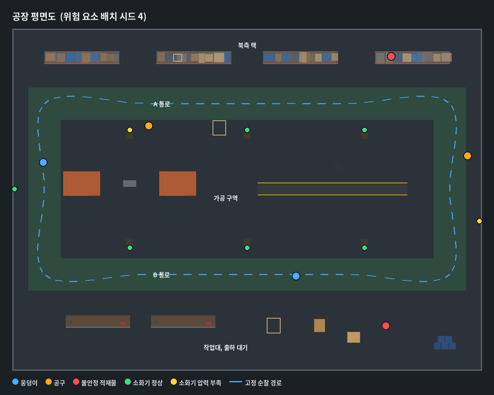

# 🏭 공장 안전 순찰 시뮬레이터 · Isaac Sim 버전

> 순찰 로봇과 작업자 바디캠이 가상 공장을 돌며 **미끄러운 바닥, 방치된 공구, 불안정 적재물, 소화기 압력 이상**을 찾아내는 피지컬 AI 프로젝트.
> 웹(three.js) 프로토타입을 **NVIDIA Isaac Sim 6.x** 로 옮기고, **YOLO 합성 데이터 생성**과 **강화학습 순찰 전략**까지 붙였습니다.

<p align="center"></p>

---

## ✨ 할 수 있는 것

| | 기능 | 스크립트 | 실행 환경 |
|---|---|---|---|
| 🤖 | **순찰 시뮬레이션**: 로봇 시점 / 바디캠 시점 / 관제 화면, 탐지 박스와 로그 | `run_patrol.py` | Isaac Sim |
| 📸 | **YOLO 학습 데이터 자동 생성**: 조명, 시점, 흔들림 무작위화 + 정답 박스 자동 계산 | `generate_dataset.py` | Isaac Sim |
| 🧠 | **YOLO 학습**: 만든 데이터로 위험 요소 검출 모델 학습 | `train_yolo.py` | 일반 파이썬 |
| 🎯 | **강화학습**: 로봇이 어디로 가고 어디를 볼지 스스로 학습 (PPO) | `train_rl.py` | 일반 파이썬 |
| 📊 | **비교 평가**: 고정 경로 순찰 vs 강화학습 정책 | `eval_rl.py` | 일반 파이썬 |
| 🎬 | **정책 재생**: 학습한 정책을 Isaac Sim 화면에서 확인 | `play_policy.py` | Isaac Sim |

---

## 🔁 전체 흐름

```
 ① 장면 만들기 ──► ② 학습 데이터 생성 ──► ③ YOLO 학습 ──► ④ 순찰에 YOLO 붙이기
   build_scene      generate_dataset       train_yolo       run_patrol --detector yolo
        │
        └────────► ⑤ 강화학습 (순찰 전략) ──► ⑥ 비교 평가 ──► ⑦ Isaac에서 재생
                     train_rl                  eval_rl          play_policy
```

- **①~④ 눈 (무엇이 위험한가)**: 카메라 영상에서 위험 요소를 알아보는 YOLO
- **⑤~⑦ 행동 (어디를 볼 것인가)**: 정해진 시간 안에 모든 위험을 찾도록 움직이는 순찰 정책

---

## 📁 폴더 구조

```
factory-safety-isaac/
├── README.md
├── requirements.txt          일반 파이썬 패키지 (강화학습, YOLO)
├── docs/layout.png           평면도 (scripts/plot_layout.py 로 생성)
├── factory_safety/           ── 핵심 패키지 ──
│   ├── config.py             공장 크기, 클래스 이름, 색상
│   ├── layout.py             ★ 공장 배치 (벽, 랙, 기계, 통로, 위험 요소 자리)
│   ├── models.py             ★ 물체 모양 (공구, 적재물, 소화기, 로봇, 작업자)
│   ├── scenario.py           위험 요소 무작위 배치
│   ├── patrol.py             순찰 경로, 로봇 시선 추적, 바디캠 흔들림
│   ├── detector.py           가상 검출기 (거리, 시야, 가림) + YOLO 래퍼
│   ├── rl_env.py             강화학습 환경 (Gymnasium)
│   ├── policy_numpy.py       학습한 정책을 numpy로 실행 (Isaac 재생용)
│   ├── dataset.py            데이터 생성 도우미 (시점 샘플링, 후처리, YOLO 형식)
│   ├── textures.py           바닥, 압력계, 표지판 텍스처 생성
│   ├── usd_scene.py          USD 장면 생성 (OpenUSD만 사용)
│   ├── isaac_utils.py        Isaac Sim 버전 차이 흡수
│   └── report.py             터미널 로그
├── scripts/                  ── 실행 파일 ──
│   ├── build_scene.py        [Isaac] 장면 생성, USD 저장
│   ├── run_patrol.py         [Isaac] 순찰 시뮬레이션
│   ├── generate_dataset.py   [Isaac] YOLO 합성 데이터
│   ├── play_policy.py        [Isaac] 강화학습 정책 재생
│   ├── train_yolo.py         [파이썬] YOLO 학습
│   ├── train_rl.py           [파이썬] 강화학습
│   ├── eval_rl.py            [파이썬] 비교 평가
│   └── plot_layout.py        [파이썬] 평면도 그림
├── tests/test_core.py        Isaac 없이 도는 테스트
├── outputs/                  결과물 (USD, 텍스처, 데이터셋, 모델)
└── .vscode/                  VSCode 작업(Task) 설정
```

`★` 표시 두 파일만 고치면 공장 배치와 물체 모양이 **USD 장면, 검출기, 강화학습 환경에 한꺼번에** 반영됩니다.

---

## 🛠 준비물

| 항목 | 내용 |
|---|---|
| Isaac Sim | **6.0 기준**으로 작성 (4.5 / 5.x 호환 코드 포함) · [공식 문서](https://docs.isaacsim.omniverse.nvidia.com/) |
| GPU | RTX 계열 NVIDIA GPU (Isaac Sim 요구 사항) |
| 일반 파이썬 | 3.10 이상, 강화학습 / YOLO 학습용 |
| 에디터 | VSCode (작업 설정 포함) |

### 설치 (Windows 기준)

가상환경을 **두 개** 만듭니다. Isaac Sim용과 학습(강화학습, YOLO)용을 나눠야 torch 충돌이 없어요.

```powershell
cd C:\dev\factory-safety-isaac          # 한글, 공백 없는 경로 추천

# 1) Isaac Sim 6.x 가상환경 (Python 3.12 필수, 용량 큼)
py -3.12 -m venv .venv-isaac
.venv-isaac\Scripts\python -m pip install --upgrade pip
.venv-isaac\Scripts\python -m pip install "isaacsim[all,extscache]==6.0.1.0" --extra-index-url https://pypi.nvidia.com
setx ISAACSIM_PYTHON "C:\dev\factory-safety-isaac\.venv-isaac\Scripts\python.exe"

# 2) 학습용 가상환경
py -3.12 -m venv .venv
.venv\Scripts\python -m pip install -r requirements.txt
```

`setx` 후에는 **VSCode를 완전히 껐다 켜야** 환경 변수가 적용돼요. 그다음 `Ctrl+Shift+P` → **Python: Select Interpreter** → `.venv` 선택.

> Isaac Sim을 공식 사이트에서 zip(바이너리)으로 받았다면 1)은 건너뛰고 `setx ISAACSIM_PYTHON "C:\isaacsim\python.bat"` 만 하면 됩니다.
> Linux는 `python3.12 -m venv`, `.venv-isaac/bin/python`, `export ISAACSIM_PYTHON=...` 로 바꾸면 같아요.

**확인** (Isaac 없이 30초)

```powershell
.venv\Scripts\python -m pytest tests -q        # 6 passed 나오면 OK
```

---

## 🚀 빠른 시작

VSCode에서 `Ctrl+Shift+P` → **Tasks: Run Task** 를 누르면 아래 명령이 전부 메뉴로 들어 있습니다.
터미널에서 직접 칠 때는 아래처럼 합니다. (PowerShell은 앞에 `&` 를 붙여 `& $env:ISAACSIM_PYTHON ...`)

```bash
# 1) 장면 확인
$ISAACSIM_PYTHON scripts/build_scene.py

# 2) 순찰 (로봇 시점 / 바디캠 / 관제 화면)
$ISAACSIM_PYTHON scripts/run_patrol.py
$ISAACSIM_PYTHON scripts/run_patrol.py --camera bodycam
$ISAACSIM_PYTHON scripts/run_patrol.py --view top --speed 2

# 3) 학습 데이터 1000장 → YOLO 학습 → 순찰에 적용
$ISAACSIM_PYTHON scripts/generate_dataset.py --num 1000
python scripts/train_yolo.py
$ISAACSIM_PYTHON scripts/run_patrol.py --detector yolo --weights outputs/yolo/factory_hazard/weights/best.pt

# 4) 강화학습 → 평가 → 재생
python scripts/train_rl.py
python scripts/eval_rl.py --model outputs/rl/ppo_patrol.zip
$ISAACSIM_PYTHON scripts/play_policy.py
```

> 처음 실행할 때는 Isaac Sim이 셰이더를 준비하느라 몇 분 걸릴 수 있어요. 두 번째부터는 빨라집니다.

---

## 📖 스크립트별 사용법

<details>
<summary><b>run_patrol.py</b> · 순찰 시뮬레이션</summary>

| 옵션 | 기본값 | 설명 |
|---|---|---|
| `--camera` | `robot` | `robot` 순찰 로봇 (1.55 m, 능동 추적) / `bodycam` 작업자 가슴 (1.38 m, 흔들림) |
| `--detector` | `sim` | `sim` 가상 검출기 / `yolo` 학습한 모델 |
| `--weights` | | YOLO 가중치 `.pt` |
| `--view` | `pov` | `pov` 카메라 시점 / `top` 관제 화면 (로봇이 보임) |
| `--seed` | 무작위 | 위험 요소 배치 시드 (같은 값이면 같은 배치) |
| `--speed` | `1.0` | 배속 |
| `--duration` | `0` | 순찰 시간(초), 0이면 창을 닫을 때까지 |
| `--record` | | 카메라 화면을 jpg로 저장할 폴더 (발표 영상용) |
| `--save-frames` | | YOLO 결과(박스 그린 이미지) 저장 폴더 |

- 가상 검출기 모드에서는 탐지된 물체에 **3D 박스**가 그려집니다 (빨강 위험, 주황 주의, 초록 정상, 파랑 분석 중).
- 터미널에 이런 로그가 찍히고, 끝나면 요약이 나옵니다.
  ```
  [00:13] 위험 미끄러운 바닥 (물기)  |  A 통로  |  바닥에 물기가 있어 미끄럼 사고 위험  |  신뢰도 73%
  [00:24] 주의 방치된 원형톱  |  동측 통로  |  톱날이 노출된 채 통로 바닥에 놓여 전선 걸림 위험  |  신뢰도 72%
  순찰 시간 02:00  |  위험 요소 7/7  |  소화기 점검 8/8
  ```
</details>

<details>
<summary><b>generate_dataset.py</b> · YOLO 합성 데이터</summary>

| 옵션 | 기본값 | 설명 |
|---|---|---|
| `--num` | `500` | 이미지 수 (처음엔 1000~3000 추천) |
| `--width` `--height` | `960` `540` | 해상도 |
| `--rt-subframes` | `8` | 프레임당 렌더링 반복 (높이면 깨끗, 느림) |
| `--scenario-every` | `25` | 몇 장마다 위험 요소 배치를 새로 섞을지 |
| `--val-every` | `7` | 7장 중 1장을 검증용으로 |
| `--no-light-random` | | 조명 무작위화 끄기 |
| `--no-post` | | 흔들림 블러, 노이즈 끄기 |
| `--max-occlusion` | `0.8` | 이보다 많이 가려진 물체는 라벨에서 제외 |
| `--gui` | | 창을 띄워 찍히는 장면 보기 |

**정답 박스 만드는 방식**: 위험 요소마다 의미 라벨(semantic label)을 붙여두고, Replicator의 `bounding_box_2d_tight` 가 **실제로 보이는 픽셀만** 감싸는 박스를 계산합니다. 사람이 라벨링할 필요가 없습니다.

**무작위화**: 시점 (로봇 1.55 m, 가슴 1.2~1.5 m, 헬멧 1.5~1.8 m, 화각 55~78°, 기울기), 조명 (세기, 색온도, 바닥 밝기), 흔들림 블러, 밝기/대비, 센서 노이즈. 드문 클래스(압력 부족, 공구)가 더 자주 찍히도록 가중치를 둡니다.

**출력**
```
outputs/dataset/
├── data.yaml            ultralytics에 바로 넣는 설정
├── README.txt           클래스별 라벨 수
├── images/{train,val}/  factory_00001.jpg ...
└── labels/{train,val}/  factory_00001.txt  (클래스 cx cy w h)
```
</details>

<details>
<summary><b>train_yolo.py</b> · YOLO 학습</summary>

| 옵션 | 기본값 | 설명 |
|---|---|---|
| `--data` | `outputs/dataset/data.yaml` | 데이터셋 |
| `--model` | `yolo11n.pt` | 시작 가중치 (`n` 빠름 → `s` → `m` 정확) |
| `--epochs` | `100` | |
| `--batch` | `16` | GPU 메모리 부족하면 줄이기 |
| `--device` | 자동 | `0` GPU / `cpu` |

결과: `outputs/yolo/factory_hazard/weights/best.pt`
</details>

<details>
<summary><b>train_rl.py / eval_rl.py / play_policy.py</b> · 강화학습</summary>

```bash
python scripts/train_rl.py --steps 3000000 --envs 8     # CPU 8코어 기준 수십 분
tensorboard --logdir outputs/rl/tb                        # 학습 곡선
python scripts/eval_rl.py --model outputs/rl/ppo_patrol.zip --episodes 30
$ISAACSIM_PYTHON scripts/play_policy.py --view top        # 관제 화면에서 재생
$ISAACSIM_PYTHON scripts/play_policy.py --baseline        # 비교: 고정 경로 순찰
```

- 학습이 끝나면 `ppo_patrol.zip` (SB3 모델) 과 `ppo_patrol.npz` (numpy 가중치) 가 같이 저장됩니다.
- Isaac 재생은 `.npz` 를 써서 **Isaac Sim 파이썬에 torch를 따로 설치할 필요가 없습니다.**
- 중간 체크포인트 변환: `python scripts/train_rl.py --export outputs/rl/checkpoints/xxx.zip`
</details>

---

## 🚧 위험 요소와 YOLO 클래스

| 번호 | 클래스 | 뜻 | 배치 규칙 (매 시나리오) | 위험도 |
|:-:|---|---|---|:-:|
| 0 | `puddle` | 미끄러운 바닥 (물기 / 기름 + 오일 캔) | 6자리 중 2곳 | 🔴 위험 |
| 1 | `power_tool` | 방치된 그라인더 / 원형톱 | 5자리 중 2곳 (작업대 끝, 통로 바닥) | 🟠 주의 |
| 2 | `unstable_stack` | 기울어진 적재물 (6~12°) | 5자리 중 2곳 (랙 선반, 팔레트) | 🔴 위험 |
| 3 | `extinguisher` | 소화기 | 8개 고정 (기둥, 벽) | |
| 4 | `gauge_normal` | 압력계 정상 (바늘 녹색) | 나머지 | 🟢 정상 |
| 5 | `gauge_low` | 압력계 부족 (바늘 적색) | 8개 중 1~2개 | 🔴 위험 |

소화기는 **몸통(`extinguisher`)과 압력계(`gauge_*`)를 따로** 라벨링합니다. 압력계는 6.5 m 안쪽, 정면에서만 읽을 수 있게 되어 있어서 로봇이 가까이 가서 확인해야 합니다.

---

## 🧠 강화학습 문제 정의

**목표**: 150초 안에 모든 위험 요소를 찾고 소화기 8개를 전부 점검하기. 빠를수록 좋음.

| 구분 | 내용 |
|---|---|
| **행동** (연속 3개) | 전진 속도 (0~1.5 m/s), 회전 속도 (±1.2 rad/s), 카메라 좌우 회전 (±1.8 rad/s, 최대 ±92°) |
| **관측** (122차원) | 위치, 방향, 카메라 각도, 속도 (6) · 주변 거리 센서 16방향 (16) · 이미 본 구역 지도 11×8 (88) · 지금 보이는 후보 3개의 방향, 거리, 신뢰도 (9) · 남은 위험 비율, 남은 소화기 비율, 경과 시간 (3) |
| **보상** | 위험 발견 **+1.0** · 정상 소화기 점검 **+0.2** · 새 구역 **+0.01** · 매 스텝 **−0.002** · 충돌 **−0.02** · 완료 시 남은 시간 비례 보너스 최대 **+2** |
| **에피소드** | 1500 스텝 (0.1초 × 1500 = 150초), 시작 위치와 방향, 위험 배치 매번 무작위 |

**기준 성능** (같은 시나리오 20개, `python scripts/eval_rl.py`)

| 정책 | 완료율 | 평균 완료 시간 | 위험 발견 | 소화기 점검 |
|---|:-:|:-:|:-:|:-:|
| 고정 경로 + 좌우 훑기만 | 10% | 141 s | 86% | 88% |
| 고정 경로 + 능동 추적 (웹 버전 방식) | 95% | 82 s | 100% | 99% |
| **강화학습 정책** | 학습 후 직접 채우기 | | | |

> 🎯 공모전 포인트: "정해진 경로만 도는 로봇 대비 **몇 % 빨리** 모든 위험을 찾는가" 를 이 표로 보여주면 됩니다.

**왜 카메라 영상 대신 요약된 관측을 쓰나요?** 영상을 직접 넣는 강화학습은 GPU 병렬 렌더링이 필요해서 학습이 훨씬 무겁습니다. 그래서 1단계는 "검출기가 알려주는 정보"를 관측으로 쓰고(일반 PC에서 빠르게 학습), 재생은 Isaac Sim 화면으로 합니다. 영상 기반 학습은 아래 로드맵에 있습니다.

---

## 🧭 좌표계

Isaac Sim 기본과 같습니다. 단위는 미터.

```
            +Y (북, 랙 구역)
               ▲
               │
  -X (서) ◄────┼────► +X (동, 출입문)
               │
               ▼
            -Y (남, 작업대)            +Z 위, yaw 0 = +X 방향, 반시계가 +
```

공장 내부 44 × 32 m, 천장 7 m. 원점은 공장 한가운데 바닥.

---

## 🔧 고치고 싶을 때

| 하고 싶은 것 | 고칠 곳 |
|---|---|
| 랙, 기계, 기둥 위치 바꾸기 | `layout.py` 의 `build_static()` 과 각 `_rack`, `_cnc` 함수 |
| 위험 요소가 놓일 자리 바꾸기 | `layout.py` 의 `PUDDLE_SLOTS`, `TOOL_SLOTS`, `STACK_SLOTS`, `EXT_MOUNTS` |
| 몇 개씩 놓을지, 확률 바꾸기 | `scenario.py` 의 `sample_scenario()` |
| 물체 모양 바꾸기 | `models.py` (박스, 원기둥, 구 조합) |
| 순찰 경로 바꾸기 | `layout.py` 의 `PATROL_PATH` |
| 조명 밝기 | `usd_scene.py` 의 `_build_lights()` 기본값, 데이터 생성 범위는 `randomize_lighting()` |
| 보상 설계 | `rl_env.py` 의 `step()` |

**새 위험 요소 추가하는 순서** (예: 바닥에 떨어진 부품)
1. `config.py` 의 `CLASSES` 에 이름 추가
2. `models.py` 에 모양 함수 추가 (라벨 대상 부품은 `role="main"`)
3. `layout.py` 에 놓일 자리 목록 추가
4. `scenario.py` 에서 자리 골라 `Hazard(...)` 로 추가
5. `python -m pytest tests -q` 와 `python scripts/plot_layout.py` 로 확인

---

## ❓ 문제 해결

| 증상 | 해결 |
|---|---|
| `No module named 'isaacsim'` | 일반 파이썬으로 실행한 경우예요. `$ISAACSIM_PYTHON` 으로 실행하세요. |
| 화면이 너무 어둡거나 밝음 | `usd_scene.py` 의 `_build_lights()` 에서 `Sun`, `Dome`, `Lamp` 세기를 조절. 렌더러 노출 설정 영향도 있어요. |
| 데이터셋 라벨이 비어 있음 | 의미 라벨 API가 버전마다 달라요. `isaac_utils.isaac_labeler()` 가 어느 방식으로 붙였는지 확인하고, Isaac Sim의 *Semantics Schema Editor* 에서 `/World/Hazards/.../main` 에 라벨이 있는지 보세요. |
| Replicator 함수 이름 오류 | `isaac_utils.py` 의 `get_annotator`, `attach`, `disable_capture_on_play` 에 버전별 대체 코드가 있어요. 오류 메시지를 보고 거기에 추가하면 됩니다. |
| 텍스처의 한글이 영어로 나옴 | 한글 폰트를 못 찾은 경우예요. `textures.py` 의 `FONT_CANDIDATES` 에 폰트 경로 추가. |
| Isaac 파이썬에 ultralytics 설치 시 torch 충돌 | `run_patrol.py --record 폴더` 로 화면만 저장하고, 일반 파이썬에서 `yolo predict model=best.pt source=폴더` 로 돌리세요. |
| 첫 실행이 너무 느림 | 셰이더 컴파일 때문이에요. 두 번째부터 빨라집니다. |

---

## ✅ 검증 상태

| 부분 | 상태 |
|---|---|
| 배치, 시나리오, 순찰, 가상 검출기, 강화학습 환경, 데이터 후처리 | 테스트 통과 (`tests/test_core.py`) · 능동 추적 로봇은 12개 시나리오 모두 2바퀴 안에 전부 발견 |
| USD 장면 생성 (`usd_scene.py`) | OpenUSD(usd-core)로 생성, 라벨, 경계 상자 검증 |
| Isaac 스크립트 흐름 | Isaac API를 흉내낸 가짜 모듈로 끝까지 실행 확인 |
| **실제 Isaac Sim 렌더링, Replicator 출력, 조명 밝기** | ⚠️ 실제 Isaac Sim에서는 아직 미확인. 버전에 따라 함수 이름 수정이 필요할 수 있어요. |
| PPO 학습 결과 | ⚠️ 직접 학습해서 위 표를 채워야 해요. |

---

## 🗺 다음 단계 (로드맵)

- **영상 기반 강화학습**: Isaac Lab의 병렬 카메라로 YOLO 결과 대신 영상을 직접 관측으로 사용
- **동적 사고 상황**: Isaac Sim 6.1의 사고 이벤트 확장(`isaacsim.replicator.incident`: 넘어짐, 유출, 화재)으로 "적재물이 쓰러지는 순간", "액체가 번지는 과정" 데이터 추가
- **실제 로봇 모델**: 기본 도형 로봇을 Isaac 에셋의 실제 이동 로봇으로 바꾸고 물리 주행
- **VR 체험**: 바디캠 시점을 XR로 연결해 작업자 시점 안전 교육 (공모전 "VR 기반" 항목)
- **ROS 2 연동**: 시뮬레이션에서 검증한 순찰 정책을 실제 로봇으로 이식

---

## 📦 사용한 것

- NVIDIA Isaac Sim, OpenUSD, Omniverse Replicator
- [Gymnasium](https://gymnasium.farama.org/) (MIT), [Stable-Baselines3](https://github.com/DLR-RM/stable-baselines3) (MIT)
- [Ultralytics YOLO](https://github.com/ultralytics/ultralytics) (AGPL-3.0, 나중에 상업적으로 쓸 계획이면 라이선스 확인 필요)
- numpy, Pillow
- 모든 3D 모델과 텍스처는 코드로 직접 생성 (외부 에셋 없음)

<sub>제조 피지컬 AI Agent 공모전 (국립창원대 앵커사업단) 출품용 프로젝트</sub>
