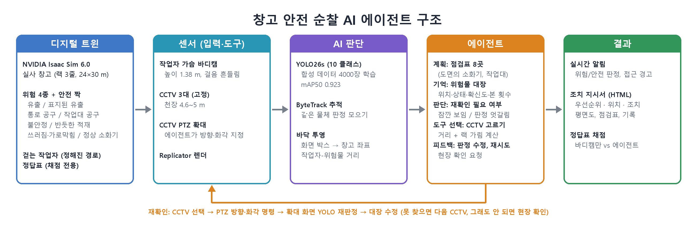
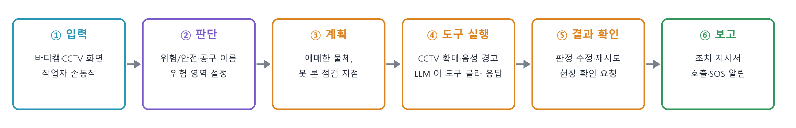
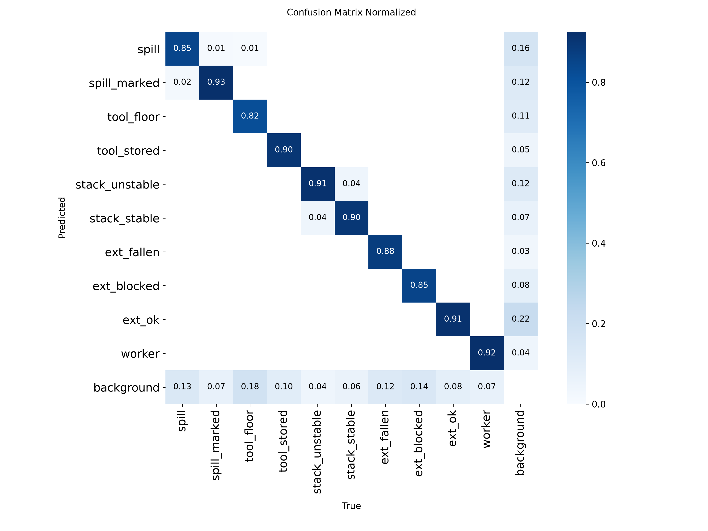
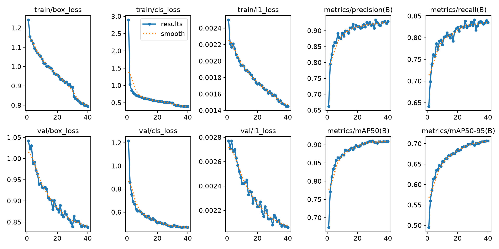

# 🏭 창고 안전 순찰 AI 에이전트 · Isaac Sim

> 작업자가 정해진 경로를 걸으며 **가슴 바디캠**으로 찍으면, **YOLO** 가 물체마다 **진짜 위험한지 아닌지** 판정하고,
> **안전 에이전트**가 판정을 위험물 대장에 모아 애매한 것은 **볼 수 있는 CCTV 를 골라 확대(PTZ)해서 다시 확인**합니다.
> CCTV 3대는 작업자와 위험물 사이 거리를 재서 가까워지면 경고하고, 순찰이 끝나면 **조치 지시서**(우선순위, 위치, 조치 방법)를 만듭니다.
> **라바콘으로 둘러친 곳, DANGER 표지가 선 곳, 스스로 위험하다고 판단한 주변은 위험 영역**으로 잡고,
> 작업자가 위험물에 닿기 직전이거나 영역에 들어서면 **"경고 경고 위험 요소가 식별되었습니다"** 하고 소리로 알립니다.
> 공구는 **망치, 드라이버, 톱, 전동톱, 곡괭이, 삽, 렌치, 전동 드릴** 중 무엇인지까지 알아봅니다.
> 작업자가 바디캠 앞에 **손가락 1~5개**를 보이면 **로컬 LLM (Qwen2.5-7B, LangGraph)** 이 도구로 상황을 보고 무엇을 알려 줄지 정해,
> 장비 설명, 공장 위험 스캔, 오늘의 TBM, 관리자 호출, SOS 를 **작업자 언어 (중국어·영어·일본어·한국어)** 음성으로 처리합니다.
> 물체마다 위험/안전 **정답표를 미리 만들어 두고** 판정 결과를 채점합니다 (판정에는 안 씀).
> 환경과 물체는 **NVIDIA 실사 에셋** (창고, 상자, 팔레트, 소화기, 표지판, 라바콘, 작업자) 과 **Poly Haven 공구 실물 스캔** (CC0) 을 씁니다.

<p align="center"></p>

제4회 경남AI·SW경진대회 (③ 제조·피지컬 AI Agent) 출품작 · IBDP 팀 (문상균, 이승혜, 조현준)

---

## ✨ 할 수 있는 것

| | 기능 | 스크립트 | 실행 환경 |
|---|---|---|---|
| 📥 | **공구 모델 받기**: Poly Haven 실물 스캔 공구 (망치, 드라이버, 톱, 곡괭이, 삽, 렌치) | `get_assets.py` | 일반 파이썬 |
| 🏗 | **장면 만들기**: NVIDIA 창고 + 위험/안전 물체 + 걷는 작업자, 정답표 저장 | `build_scene.py` | Isaac Sim |
| 📸 | **학습 데이터 자동 생성**: 바디캠, CCTV, 자유 시점에서 촬영 + 정답 박스 자동 계산 | `generate_dataset.py` | Isaac Sim |
| 🧠 | **YOLO 학습**: 위험한 상태와 안전한 상태를 따로 가르쳐서 YOLO 가 직접 구분, 공구는 종류별로 | `train_yolo.py`, `val_yolo.py` | 일반 파이썬 |
| 🤖 | **순찰 + 에이전트**: 바디캠 판정, CCTV 접근 경고, CCTV 확대 재확인, 위험 영역, 음성 경고, 조치 지시서, 정답표 채점 | `run_patrol.py` | Isaac Sim |
| ✋ | **손동작 명령**: 손가락 1~5 → 장비 설명, 공장 위험 스캔, TBM, 관리자 호출, SOS (작업자 언어 음성) | `run_patrol.py --story`, `test_gestures.py` | Isaac Sim + `.venv-assistant` |
| 💬 | **LLM 에이전트**: LangGraph + 로컬 Qwen2.5-7B (Ollama) 가 손동작 요청마다 도구로 상황을 보고 무엇을 말할지·근거·관리자 메시지를 정함 | `llm_agent.py` | `.venv-assistant` + Ollama |
| 📊 | **여러 시나리오 평가**: 순찰을 시드별로 돌려 채점 표 (바디캠만 vs 에이전트) | `eval_patrol.py` | 일반 파이썬 (내부에서 Isaac) |
| 🎬 | **시연 영상**: 녹화한 화면과 에이전트 기록을 1920x1080 영상으로 | `make_video.py` | 일반 파이썬 |
| 📝 | **제출 문서**: 개발완료보고서, 기술설명서, 발표자료 (수치는 채점 결과에서) | `make_docs.py`, `make_slides.py` | 일반 파이썬 |
| 🖥 | **전체 시연**: Isaac 창을 단계별로 띄워 보여주고 조치 지시서를 엶 | `demo_all.py` | 일반 파이썬 (내부에서 Isaac) |

---

## 🔁 전체 흐름

```
 ① 장면 + 정답표 ──► ② 학습 데이터 (7700장) ──► ③ YOLO 학습 ──► ④ 순찰 + 에이전트 ──► ⑤ 조치 지시서 + 정답표 채점
   build_scene        generate_dataset            train_yolo       run_patrol              eval_patrol
```

---

## 🤖 에이전트가 하는 일 (`factory_safety/agent.py`)

<p align="center"></p>

| 요소 | 구현 |
|---|---|
| **목표 (Goal)** | 순찰 한 바퀴 동안 위험물을 찾아 위험/안전을 판정하고, 작업자 접근을 경고하고, 조치 지시서를 만든다 |
| **계획 (Planning)** | 순찰 전에 도면(소화기 6곳, 작업대 2곳)으로 **점검표**를 만들고 지점마다 볼 수 있는 CCTV 를 계산. 순찰이 끝나면 못 본 지점을 CCTV 확대 일정으로 바꿈 |
| **판단 (Reasoning)** | 재확인이 필요한 물체를 고름: 바디캠에 1~2프레임만 보이고 지나감, 판정 표 1등이 70% 미만, CCTV 경고로 처음 알게 된 물체. 2초 기다렸다가 그사이 바디캠이 확정하면 취소 |
| **도구 (Tool)** | 바디캠, CCTV 3대, **CCTV PTZ** (방향·화각 명령), YOLO, 바닥 투영 거리 계산, 음성 경고, 조치 지시서(HTML). 손동작 요청은 LLM 이 도구를 골라 부름 (아래) |
| **기억 (Memory)** | **위험물 대장**: 위치, 출처별 판정 표, 확신도, 본 횟수, 접근 경고 횟수, 상태 (확정 / 재확인 대기 / 재확인 완료 / 현장 확인 필요 / 기각 / 병합) |
| **피드백 (Feedback)** | 확대 판정을 대장에 합쳐 판정 수정, 확대 화면(높이 5 m)에서 구한 위치로 대장 위치를 고치고 중복이면 병합. 못 찾거나 확신 50% 미만이면 **다른 CCTV 로 재시도**, 끝까지 안 되면 **현장 확인 요청** (나중에 바디캠이 확정하면 취소). 같은 물체가 다른 종류로 잡히면 병합 |

**도면 제약**: 소화기는 도면의 거치 자리에만, 작업대 공구는 작업대 위에만 있다고 보고 위치를 맞춥니다. 벽 밖으로 1 m 넘게 나간 바닥 추정은 버리고, 랙 안에 떨어진 추정은 랙 면으로 밀어냅니다.

**CCTV 고르기**: 재확인할 점과 CCTV 사이 선분이 랙(높이 6 m, CCTV 5 m 보다 높음)·기둥이나 대장에 있는 적재물(약 1.7 m)에 막히는지, 거리가 32 m 안인지 계산해서 가까운 순으로 시도합니다. PTZ 는 목표점을 향하고, 화면 세로가 4 m → 2.6 m 가 되게 두 장 찍습니다.

```
[00:01] <재확인 계획> F03 남쪽 작업 구역: 바디캠에 1프레임만 보이고 지나감 (정상 비치 소화기?) → cctv_west 확대로 재확인 예약 (10 m, cctv_south 는 F01 적재에 가림)
[00:03] <CCTV 선택> cctv_west PTZ 를 F03 남쪽 작업 구역 쪽으로 돌려 확대 (화각 23°, 10 m)
[00:03] <재확인> F03 cctv_west 확대 결과 안전 정상 비치 소화기 89% 확인
[00:08] <위치 보정> F06 확대 화면으로 위치를 (+7.2, +16.4) → (+6.8, +17.2) 로 고침
[00:08] <판정 수정> F06 cctv_east 확대 결과 반듯한 적재 88% → 무너질 듯한 적재 에서 안전 반듯한 적재 로 고침
[00:08] <접근 경고> cctv_south: 작업자 ↔ 방치된 유출 (기름/물) 1.4 m  |  서쪽 통로 → 대장 F09 우선순위 올림
[00:25] <재확인 취소> F12 기다리는 동안 바디캠이 다시 보고 확정 → CCTV 확대 안 함
[00:47] <현장 확인> C6 소화기 6 (동쪽 랙 남쪽 끝): CCTV 로 확인 못 함 → 작업자에게 현장 확인 요청
[00:47] <재확인> F17 cctv_east 확대 결과 위험 쓰러진 소화기 91% 확인
```

**위험 영역** (`factory_safety/zones.py`)

| 근거 | 영역 |
|---|---|
| 라바콘 | 바닥 위치가 3 m 안으로 이어진 라바콘 2개 이상을 한 영역 (볼록 다각형 + 0.3 m). 라바콘을 둘러친 조치된 유출도 영역이 됨 |
| DANGER 표지 | 표지 주변 1.2 m (라바콘 영역 근처면 그 영역에 합침) |
| 에이전트 판단 | 물건이 아니라 주변이 위험한 것: 방치된 유출 (미끄럼 1.3 m), 무너질 듯한 적재 (붕괴 1.6 m). 3 m 안에 모인 위험물은 한 영역. 라바콘·표지 영역 안이면 따로 안 만듦 |

**음성 경고** (`factory_safety/voice.py`): 작업자가 위험물 1 m 안 (닿기 직전) 이나 위험 영역 경계 0.5 m 안에 들어서면
경보음 + "경고! 경고! 위험 요소가 식별되었습니다." (Windows 한국어 음성 Heami). 대장에 기억한 위험물과 지금 바디캠 화면을 둘 다 보고,
같은 대상은 12초, 경고끼리는 5.5초 간격. Isaac 창으로 순찰하면 소리가 바로 나고, 시연 영상에는 소리 트랙으로 들어갑니다.

**공구 이름**: YOLO 가 공구를 종류별(8종)로 알아보고, 위험/안전은 **놓인 자리**로 에이전트가 판단합니다.
공구 박스 아래쪽을 작업대 윗면 높이로 투영해 작업대 위면 "정리된 공구", 아니면 "통로에 방치된 공구". 조치 지시서에는 "통로에 방치된 공구 (망치, 삽)" 처럼 이름까지 나옵니다.

**손동작 명령** (`factory_safety/assistant.py`, `hand_count.py`, `i18n.py`, `llm_agent.py`): 작업자가 멈춰 서서 오른손을 아래에서 바디캠 앞으로 들어 올려 손바닥을 보이고 손가락을 폅니다.

| 손가락 | 명령 | 에이전트가 하는 일 |
|:-:|---|---|
| 1 (검지) | 장비 설명 | 바로 전 바디캠 화면 가운데의 장비 (운반 카트, 공구, 소화기 등) 가 무엇인지, 안전하게 쓰는 법, 지금 상태 (바닥에 있으면 작업대로) |
| 2 (+중지) | 공장 위험 스캔 | 위험물 대장에서 공장 전체의 위험을 LLM 이 고른 순서로 (같은 종류·구역은 한 번), 위험 영역 수. CCTV 가 있으면 말하는 동안 CCTV 확대가 그 위험들을 차례로 비춤 |
| 3 (+약지) | 오늘의 TBM | 아침 작업 전 안전 회의 (`data/tbm_today.json`: 오늘 작업, 주의할 위험, 지킬 것, 지난 순찰 조치) |
| 4 (+새끼) | 관리자 호출 | 작업자 위치·언어, 가까운 위험, LLM 요약 메시지를 조치 지시서 알림으로 |
| 5 (손바닥) | SOS 신고 | 경보음 + 위치 알림, **작업자를 볼 수 있는 CCTV 를 골라 PTZ 로 작업자를 확대** |

- **인식**: MediaPipe Hands 로 손 관절 21점 → 손가락마다 마디가 곧은지 (각도) 와 손목에서 먼지, 엄지는 약지 뿌리까지 거리로 수를 셈. 손이 기울어도 되게 화면 방향은 안 씀. 멈춘 손에서 같은 수가 3번 연속이면 명령, 손을 내려야 다시 받음
- **판단 (LLM 에이전트, `factory_safety/llm_agent.py`)**: 명령이 오면 지금 상황 (방금 바디캠에 보인 물체, 위험물 대장, 위험 영역, 오늘 TBM, 작업자 위치) 을 넘기고,
  LangGraph 그래프에서 로컬 **Qwen2.5-7B** (Ollama, 인터넷·API 키 없음) 가 도구를 골라 부른 뒤 `finish` 로 결정합니다. 도구 없이 글로만 답하면 `finish` 를 부르라고 한 번 더 요청하고, 그래도 안 되거나 Ollama 가 꺼져 있으면 규칙으로 정합니다

  ```mermaid
  flowchart LR
    S([손동작 명령]) --> A[agent<br/>Qwen2.5-7B]
    A -- 도구 호출 --> T[tools<br/>look_around · equipment_info · hazard_log<br/>todays_tbm · worker_status]
    T --> A
    A -. 글로만 답함 .-> M[remind] -.-> A
    A -- finish --> R[결정<br/>말할 항목 · 근거 · 관리자 메시지]
    R --> V[검수한 문장 틀로 작업자 언어 음성]
  ```

  | 도구 | 하는 일 |
  |---|---|
  | `look_around` | 최근 몇 초 바디캠에 보인 물체 (번호, 이름, 거리, 방향, 화면 가운데에서 얼마나 먼지) |
  | `equipment_info(id)` | 그 물체가 무엇이고 어떻게 안전하게 쓰는지 |
  | `hazard_log(limit)` | 공장 전체 위험물 대장 (우선순위 순, 구역, 작업자와 거리) |
  | `todays_tbm` / `worker_status` | 오늘 TBM / 작업자 위치·구역 |
  | `finish(say_ids, reason_ko, manager_ko)` | 말할 항목 (도구가 준 번호만 받음), 한국어 근거, 관리자 메시지 |

  LLM 은 안전 문장을 직접 쓰지 않습니다 (말할 것만 고름). 판단 근거는 에이전트 기록에 `LLM 판단` 으로 남고, 관리자 메시지는 확인된 사실 (위치, 가까운 위험) 뒤에 `AI 요약` 으로 붙습니다
- **언어**: 안내 문장은 사람이 검수한 4개 언어 문장 틀 + 현장 용어집으로 만듭니다. 번역 모델 (NLLB-200) 을 시험했더니 "안전화 → seat belt", "지게차 → parking lot" 처럼 현장 용어를 틀려서 안전 안내에는 쓰지 않습니다. 관리자에게는 한국어로 같이 남김
- **음성**: edge-tts (Microsoft 온라인 신경망 음성, 인터넷 필요). 안 되면 Windows 음성 (한국어·영어·일본어). 만든 음성은 문장별로 저장해 다시 씀
- **시뮬레이션**: 작업자 뼈대에 손가락 1~5 자세를 직접 만듭니다 (`walk_anim.py`). 손을 아래에서 위로 들어 올리며 손바닥이 카메라를 보게 돌리고, 손가락은 위로 조금 벌려 세우고, 엄지는 손바닥 쪽으로 접습니다 (팔은 2관절 IK).
  손가락을 붙이면 비스듬한 화면에서 약지가 가운뎃손가락 뒤에 가려 36/40 이었고, 벌려서 37~38/40 (RTX 렌더가 매번 조금 달라 시험마다 한 번쯤 다름).
  시연 이야기는 `story.py` 가, `--gestures demo` 는 `DemoScript` 가 작업자 역할로 손동작을 합니다
- **프로세스**: Isaac Sim 파이썬에는 MediaPipe·LangGraph 를 같이 깔 수 없어서 (Isaac 이 고정한 패키지 버전이 바뀜) 손 인식·음성·LLM 은 `.venv-assistant` 에서 따로 띄운 프로세스 (`scripts/assistant_worker.py`) 가 맡습니다

**시연 이야기** (`factory_safety/story.py`, `run_patrol.py --story`, 작업자 언어 영어, **CCTV 없이 바디캠만**, 음성 경고는 한 번만): 작업자 역할만 정해 두고 에이전트는 바디캠 화면과 손동작으로만 압니다.

1. 시작하자마자 손가락 3 → 오늘의 TBM ("카트로 상자 4개를 북쪽 보관 구역에서 남쪽 작업 구역으로", 주의할 위험, 지킬 것)
2. 순찰하며 걷기 (에이전트가 위험/안전 판정, 위험 영역, 닿기 직전 음성 경고 한 번)
3. 북쪽 보관 구역에서 운반 카트를 3초 보고 손가락 1 → LLM 이 `look_around` → `equipment_info` 로 카트를 골라, 쓰는 법과 주의점
4. 옆 팔레트의 상자 4개를 카트에 싣고 왼손으로 카트를 끌며 걷기 (오른손은 손동작)
5. 동쪽 통로 중간에서 손가락 2 → 공장 전체 위험 스캔 (LLM 이 `hazard_log` 에서 알릴 위험과 순서를 고름)
6. 한 바퀴를 다 돌면 손가락 4 → 관리자 호출 (위치·가까운 위험 + LLM 요약), 시뮬레이션 끝

**조치 지시서** (`outputs/agent/dashboard_seed<시드>.html`): 평면도(번호 = 우선순위, 위험 영역), 조치 목록 (긴급/높음/보통, 위치, 조치 방법, 근거), 위험 영역, 음성 경고 기록, 점검표, 에이전트 기록. 우선순위 점수 = 위험 종류별 심각도 + 접근 경고 횟수 × 2.

---

## 🚧 위험한 상태 vs 안전한 상태 (YOLO 클래스)

같은 종류의 물체를 **위험한 상태와 안전한 상태로 함께** 놓고, YOLO 가 상태까지 구분합니다.

| 종류 | 위험 (🔴) | 안전 (🟢) | 실사 에셋 |
|---|---|---|---|
| 바닥 유출 | `spill` 기름/물 웅덩이 + 쓰러진 통·양동이, 아무 조치 없음 | `spill_marked` 같은 유출 + **미끄럼 주의 표지판, 라바콘** | 웅덩이는 직접 만든 광택 재질, 통·표지판·라바콘은 NVIDIA |
| 공구 | 통로 바닥에 방치 (`tool_floor`) | **작업대 위**에 정리 (`tool_stored`) | YOLO 는 종류 8개 (`hammer` `screwdriver` `saw` `power_saw` `pickaxe` `shovel` `wrench` `drill`) 로 알아보고 자리는 에이전트가 판단. Poly Haven 실물 스캔 (CC0), 전동톱은 직접 모델링, YCB 드릴 |
| 적재 | `stack_unstable` 맨 위 층이 밀려나 기울고 팔레트 밖으로 삐져나옴 (상자가 떨어져 있기도) | `stack_stable` 반듯하게 쌓인 상자 | NVIDIA 팔레트, 골판지 상자 |
| 소화기 | `ext_fallen` 바닥에 쓰러짐 · `ext_blocked` 앞을 상자가 가로막음 | `ext_ok` 랙 끝 제자리에 보이게 비치 | NVIDIA 소화기 |
| 작업자 | `worker` (CCTV 거리 측정용) | | NVIDIA 건설 작업자 + 직접 만든 걷기 동작 |
| 위험 영역 표시 | `cone` 라바콘, `danger_sign` DANGER 표지 (A자형, "위험 구역 출입 금지") | | NVIDIA 라바콘, 표지는 직접 모델링, 안쪽에 뚜껑 열린 바닥 구멍이 있기도 함 |
| 장비 | | `cart` 운반 카트 (판정 대상 아님, 손동작 1 로 쓰는 법 안내) | Poly Haven 핸드트럭 (CC0, 세움·끄는 자세·상자 0~4개), 창고에 원래 있던 평판 카트 |

**배치** (시나리오마다 무작위): 위험 영역 2곳 (라바콘 링 4~6개 60% / DANGER 표지만 40%, 경로에서 경계까지 0.4~0.9 m), 유출 3곳 (45% 조치됨),
통로 공구 2~3곳 (1~3개씩, 종류 무작위), 작업대 2개, 팔레트 4곳 (절반 불안정), 소화기 6곳 (정상 60%, 쓰러짐 20%, 가로막힘 20%).
경로 바로 옆 (0.4~0.5 m) 에 위험물 하나는 꼭 둡니다 (닿기 직전 음성 경고 시험). 공구 모델은 `python scripts/get_assets.py` 로 받습니다.

---

## 🧑‍🏭 판정과 채점

**판정** (실시간, 정답 안 씀, `factory_safety/inspection.py` + `agent.py`)

| | 방법 |
|---|---|
| 바디캠 | YOLO 추적 (ByteTrack) 으로 같은 물체에 번호를 붙이고, 3프레임 이상 같은 판정이면 **위험/안전** 을 한 번 알림. 가까이서 판정이 바뀌면 다시 알림 |
| CCTV 3대 | YOLO 로 작업자와 위험 물체를 찾고, 박스 아래쪽 (유출은 가운데) 을 바닥에 투영해 공장 좌표를 구한 뒤 **거리가 2 m 안이면 접근 경고** (같은 물체는 5초에 한 번) |

**채점** (끝나고, 정답표와 비교)

- 정답표: 시나리오를 만들 때 물체마다 `id, 클래스, 위험 여부, 위치, 구역` 을 `outputs/eval/answer_key_seed<시드>.json` 에 미리 저장
- 바디캠: 매 프레임 Replicator 정답 박스 (어느 물체인지 경로까지) 와 YOLO 박스를 겹침으로 맞추고, 물체마다 모인 판정을 정답과 비교 → **위험을 위험으로 / 위험을 안전으로 오판 / 안전을 위험으로 오판 / 놓침 / 경로에서 안 보임**
- CCTV: 실제 작업자 위치와 물체 위치로 진짜 거리를 구해 경고가 맞았는지, 위치·거리 오차가 얼마인지
- 에이전트: 최종 위험물 대장을 **창고 전체 물체**(경로에서 안 보이는 것 포함)와 위치·종류로 맞춰 비교. **바디캠만**(바디캠이 확정한 것만, 바디캠 판정 그대로) 과 **에이전트**(재확인, 점검표 포함) 를 같은 기준으로 비교

---

## 📊 결과

### YOLO (YOLO26s, 960 px, 19 클래스, 합성 데이터 7700장, 18 클래스 모델에서 이어 15 epoch)

데이터: 일반 촬영 5000장 (학습 4286 + 검증 714, 바디캠·CCTV·자유 시점·위험 영역) + 공구 가까이 1500장 (학습 1286 + 검증 214)
+ 운반 카트 1200장 (학습 1029 + 검증 171, 카트 라벨 2058개).

| 클래스 | mAP50 | | 클래스 | mAP50 | | 클래스 | mAP50 |
|---|:-:|---|---|:-:|---|---|:-:|
| 🔴 `spill` | 0.920 | | 🟢 `spill_marked` | 0.937 | | `worker` | 0.950 |
| 🔴 `stack_unstable` | 0.957 | | 🟢 `stack_stable` | 0.960 | | `cone` | 0.976 |
| 🔴 `ext_fallen` | 0.907 | | 🟢 `ext_ok` | 0.938 | | `danger_sign` | 0.950 |
| 🔴 `ext_blocked` | 0.909 | | `hammer` | 0.862 | | `screwdriver` | 0.828 |
| `saw` | 0.806 | | `power_saw` | 0.901 | | `pickaxe` | 0.845 |
| `shovel` | 0.819 | | `wrench` | 0.887 | | `drill` | 0.915 |
| `cart` (운반 카트) | 0.794 | | | | | | |

**전체 mAP50 0.898, mAP50-95 0.689** (정밀도 0.920, 재현율 0.827). 공구 8종과 운반 카트가 0.79~0.92 로 가장 약하고, 공구의 위험/안전은 YOLO 가 아니라 에이전트가 놓인 자리로 정합니다.

<p align="center"> </p>

학습된 가중치는 `outputs/yolo/warehouse_v3/weights/best.pt` 에 들어 있어서 데이터 생성과 학습 없이 바로 순찰을 돌릴 수 있습니다.

**실제 사진 시험** (`detect_image.py`): 책상 위 공구를 위에서 가까이 찍은 휴대폰 사진 3장 (커터칼, 일자 드라이버, 가위) 에서 학습한 클래스인 드라이버를 놓치고 손잡이를 작업자로 봤습니다.
학습 데이터의 드라이버는 화면의 0.05~4% 크기 (바디캠으로 1~5 m 앞 바닥) 인데 이 사진은 화면의 13% 를 채워서, 실제 현장 적용 전에 현장 사진으로 미세조정이 필요합니다.

### 순찰 채점 (학습에 안 쓴 배치 10개, 한 바퀴씩, `eval_patrol.py --seeds 0 1 2 3 4 5 6 7 8 9`)

**에이전트 최종 위험물 대장** (창고 전체 물체 173개, 경로에서 안 보이는 물체 포함)

| 항목 | 바디캠만 | 에이전트 (재확인 + 점검표) |
|---|:-:|:-:|
| 위험 물체를 위험으로 | 71/92 (77%) | **83/92 (90%)** |
| 안전 물체를 안전으로 | 33/81 (41%) | **78/81 (96%)** |
| 위험을 안전으로 / 안전을 위험으로 오판 | 0 / 0 | **0 / 0** |
| 상태까지 정확 | 104/173 | **161/173** |
| 없는 위험 보고 | 11 | 8 |
| 현장 확인 요청 (그중 실제 물체) | - | 8 (7) |

- **바디캠만**: 바디캠이 3프레임 이상 확정한 물체만, 바디캠 판정 그대로. **에이전트**: CCTV 확대 재확인, 점검표, 위치 보정·병합까지 거친 최종 대장
- 재확인 113건 실행 (요청 140건 중 21건은 기다리는 동안 바디캠이 확정해서 취소): 다시 찾음 98, 판정 고침 3 (셋 다 정답과 맞게), 다른 CCTV 로 재시도 20, 현장 확인 19, 오검출로 뺌 7
- 끝내 못 찾은 위험 9개: 통로 바닥 공구 6, 소화기 3 (기둥·적재물에 가려 CCTV 로 못 보고 현장 확인으로 넘어간 것 포함)
- **없는 위험 보고**: 정답과 안 맞는 위험 항목 10개 중 8개가 **중복**입니다. 이미 제자리에 잡힌 물체를 멀리서 다시 봐서 바닥 투영 위치가 2~7 m 어긋나고, 같은 물체로 묶이지 않아 대장에 한 번 더 올라간 것. 거리에 따라 묶는 범위를 넓히거나 먼 관찰은 새 항목을 만들지 않게 고칠 계획
- 운반 카트를 돌아보다 잠깐 다른 물체로 잡힌 추적은, 같은 추적 번호가 카트로 보이면 대장에서 뺍니다 (장비는 위험/안전 판정 대상이 아님)

**위험 영역, 음성 경고, 공구 이름** (같은 10개 배치)

| 항목 | 결과 |
|---|:-:|
| 위험 영역 (라바콘 링, DANGER 표지) 알아봄 | **20/20** |
| 엉뚱한 곳에 만든 표시 영역 | 4 |
| 에이전트가 스스로 판단한 위험 영역 (그중 실제 위험 주변) | 43 (40) |
| 작업자가 닿기 직전 (위험물 1 m, 영역 0.5 m) 사건에 음성 경고 | **29/37** |
| 음성 경고 중 실제 사건에 맞은 것 | 29/40 |
| 공구 이름 맞힘 (정답 공구 중) | 40/75 |

**바디캠 YOLO 판정** (경로에서 보인 물체 152개, 프레임 단위 채점)

| 항목 | 결과 |
|---|:-:|
| 위험 물체를 위험으로 판정 | **87/89 (98%)** |
| 안전 물체를 안전으로 판정 | **61/63 (97%)** |
| 위험을 안전으로 / 안전을 위험으로 오판 | **0 / 1** |
| 정답 없는 곳에 위험 박스 | 62 / 2340 프레임 |

**CCTV 접근 경고** (2 m, CCTV 3대)

| 항목 | 결과 |
|---|:-:|
| 작업자가 위험물 2 m 안으로 다가간 사건 | 27 |
| 경고 성공 | **24/27** |
| 오경보 (실제 3 m 넘는데 경고) | 6번 |
| 작업자 위치 오차 / 거리 오차 (중앙값) | **0.29 m / 0.29 m** |

**시연 이야기** (시나리오 5, `--story`, CCTV 없음)

| 항목 | 결과 |
|---|:-:|
| 손동작 (TBM, 카트 설명, 공장 스캔, 관리자 호출) | **4/4** 맞게 인식, 잘못 실행 0 |
| LLM (Qwen2.5-7B) 이 결정한 요청 | **4/4** (요청당 2.2~5.5초, 도구 2~5번 호출) |
| 음성 경고 | 1번 (TBM 을 듣고 출발한 뒤 라바콘 영역 0.5 m) |
| 시연 영상 | 2분 41초, `outputs/video/demo.mp4` (용량이 커서 저장소에는 없음) |

### 손동작 명령 (`test_gestures.py`, 경로 8곳 x 손가락 1~5, 곳마다 조명 무작위)

순찰 때와 똑같이 손을 올리고 → 2초쯤 들고 → 내리는 동안의 바디캠 화면 (0.1초마다) 을 명령 확정 필터에 넣어 채점했습니다.

| 항목 | 결과 |
|---|:-:|
| 보인 손가락 수대로 명령이 한 번 나옴 | **37/40** |
| 다른 명령이 나옴 | 3 (손가락 2 → 1 두 번, 3 → 2 한 번: 어둡거나 역광인 손에서 MediaPipe 가 검지 관절을 접힌 것으로 봄) |
| 명령이 안 나옴 | 0 |
| 손을 다 올린 화면 중 수를 맞힘 | 478/520 |
| 손을 올리고 내리는 중 잘못 실행된 명령 | **0** (멈춘 손만 셈) |

`score_gestures.py` 는 저장한 시험 화면 (`--raw`) 으로 Isaac 없이 다시 채점합니다 (손 인식 기준을 바꿀 때, JPEG 로 저장한 화면이라 실시간 시험과 한두 번 다를 수 있음).

시나리오별 표는 [`outputs/eval/patrol_results.md`](outputs/eval/patrol_results.md), 물체별 판정은 `outputs/eval/inspection_seed<시드>.json`, 조치 지시서는 `outputs/agent/dashboard_seed<시드>.html`.
시드마다 약 5분 (Isaac 안 YOLO 는 CPU). RTX 렌더링이 매번 조금씩 달라서 같은 시드라도 결과가 한두 개 달라질 수 있습니다.

---

## 📁 폴더 구조

```
factory-safety-isaac/
├── README.md
├── requirements.txt          일반 파이썬 패키지 (YOLO 학습, 평가, 테스트)
├── docs/                     구조도, 평면도, YOLO 혼동 행렬과 학습 곡선, 보고서 그림
├── factory_safety/           ── 핵심 패키지 ──
│   ├── config.py             클래스 (위험/안전, 공구 8종, 라바콘·표지), 에셋 주소, 경고 거리
│   ├── warehouse.py          ★ 창고 배치: 순찰 경로, 물체 자리, 작업대, CCTV 위치, 구역 이름
│   ├── scenario.py           ★ 위험/안전 물체 무작위 배치 + 정답표
│   ├── scene.py              USD 장면: 창고 참조, 물체 묶음 + 의미 라벨, 작업자, 카메라
│   ├── walk_anim.py          작업자 걷기 동작과 손동작 자세 (뼈대에 직접 만듦)
│   ├── walker.py             정해진 경로 걷기 + 가슴 바디캠 흔들림
│   ├── agent.py              ★ 안전 에이전트: 점검표 계획, 위험물 대장, CCTV 선택·확대 재확인, 조치 지시서, 채점
│   ├── zones.py              위험 영역 (라바콘 묶음, DANGER 표지, 에이전트 판단)
│   ├── voice.py              음성 경고 (경보음 + Windows 한국어 음성)
│   ├── overlay.py            화면에 박스와 한국어 이름, 손 관절 그리기
│   ├── assistant.py          손동작 명령 1~5 실행 (장비 설명, 공장 스캔, TBM, 호출, SOS)
│   ├── llm_agent.py          [.venv-assistant] LLM 에이전트 (LangGraph + 로컬 Qwen2.5-7B, 도구 6개)
│   ├── story.py              시연 이야기 (TBM → 카트 설명 → 상자 싣고 끌기 → 공장 스캔 → 관리자 호출)
│   ├── assistant_client.py   손 인식·음성 도우미 프로세스 부르기
│   ├── hand_count.py         손 관절 21점 → 손가락 수, 연속 확인
│   ├── i18n.py               4개 언어 문장 틀, 현장 용어집, TBM 항목
│   ├── dashboard.py          조치 지시서 HTML (평면도, 위험 영역, 조치 목록, 음성 경고, 점검표, 기록)
│   ├── inspection.py         바닥 투영, 바디캠 프레임 채점, CCTV 거리 경고
│   ├── detector.py           YOLO 래퍼 (추적 포함)
│   ├── dataset.py            학습 데이터 촬영 시점, 후처리, YOLO 형식
│   ├── geometry.py           카메라 투영, 회전
│   ├── isaac_utils.py        Isaac Sim 버전 차이 흡수, Replicator 도우미
│   └── report.py             터미널 로그
├── scripts/
│   ├── get_assets.py         [파이썬] Poly Haven 공구 모델 받기
│   ├── build_scene.py        [Isaac] 장면 + 정답표
│   ├── generate_dataset.py   [Isaac] YOLO 합성 데이터
│   ├── run_patrol.py         [Isaac] 순찰 + 에이전트, 조치 지시서, 채점 (--story 로 시연 이야기)
│   ├── test_gestures.py      [Isaac] 손동작 인식 시험 (경로 여러 곳 x 손가락 1~5)
│   ├── score_gestures.py     [.venv-assistant] 저장한 시험 화면으로 다시 채점
│   ├── assistant_worker.py   [.venv-assistant] MediaPipe 손 인식 + 다국어 음성 + LLM 에이전트
│   ├── train_yolo.py         [파이썬] YOLO 학습
│   ├── val_yolo.py           [파이썬] YOLO 검증 점수 (metrics.json)
│   ├── compare_yolo.py       [파이썬] YOLO 가중치 비교
│   ├── eval_patrol.py        [파이썬] 여러 시나리오 평가 (내부에서 Isaac)
│   ├── demo_all.py           [파이썬] 전체 시연 (내부에서 Isaac)
│   ├── make_video.py         [파이썬] 시연 영상 (run_patrol --record 결과로)
│   ├── make_figures.py       [파이썬] 구조도, 흐름도
│   ├── pick_figures.py       [파이썬] 녹화에서 보고서 그림 고르기
│   ├── make_docs.py          [파이썬] 개발완료보고서, 기술설명서 (docx)
│   ├── make_slides.py        [파이썬] 발표자료 (pptx)
│   ├── to_pdf.ps1            [PowerShell] docx, pptx → PDF (Word, PowerPoint 필요)
│   └── plot_layout.py        [파이썬] 평면도
├── data/tbm_today.json       오늘 TBM (작업, 위험, 지킬 것, 지난 순찰 조치)
├── tests/test_core.py        Isaac 없이 도는 테스트
└── outputs/                  결과물 (저장소에는 eval/ 채점 결과, agent/ 조치 지시서, yolo/warehouse_v3/weights/best.pt 만)
```

`★` 두 파일을 고치면 경로, 물체 자리, 배치 확률이 장면, 학습 데이터, 순찰, 채점에 한꺼번에 반영됩니다.

---

## 🛠 준비물과 설치

| 항목 | 내용 |
|---|---|
| Isaac Sim | **6.0.1** (pip 설치) · [공식 문서](https://docs.isaacsim.omniverse.nvidia.com/) |
| GPU | RTX 계열 NVIDIA GPU (확인한 환경: RTX 4060 Ti 16 GB) |
| 인터넷 | NVIDIA 에셋 서버에서 창고와 소품을 불러옴 (처음 한 번은 느림) |
| 일반 파이썬 | 3.12, YOLO 학습과 평가용 |

```powershell
cd C:\dev\factory-safety-isaac          # 한글, 공백 없는 경로 추천

# 1) Isaac Sim 6.x 가상환경 (Python 3.12 필수, 용량 큼)
py -3.12 -m venv .venv-isaac
.venv-isaac\Scripts\python -m pip install --upgrade pip
.venv-isaac\Scripts\python -m pip install "isaacsim[all,extscache]==6.0.1.0" --extra-index-url https://pypi.nvidia.com
setx ISAACSIM_PYTHON "C:\dev\factory-safety-isaac\.venv-isaac\Scripts\python.exe"
# Isaac 안에서 YOLO 와 추적을 돌리려면 (Isaac 의 torch 는 건드리지 않게 --no-deps)
.venv-isaac\Scripts\python -m pip install --no-deps ultralytics==8.4.166 ultralytics-thop polars lap

# 2) 학습용 가상환경
py -3.12 -m venv .venv
.venv\Scripts\python -m pip install -r requirements.txt
# Windows 에서는 위 명령이 CPU 전용 torch 를 깔아요. GPU 학습용으로 CUDA 빌드로 바꿔주기
.venv\Scripts\python -m pip install torch==2.14.0 torchvision==0.29.0 --index-url https://download.pytorch.org/whl/cu126 --force-reinstall --no-deps

# 3) 손동작·다국어 음성·LLM 도우미 (손동작 명령을 쓸 때만, 손 모델은 처음 실행 때 받음)
#    Isaac 환경 (.venv-isaac) 에는 깔지 마세요. Isaac 이 고정한 패키지 버전이 바뀝니다
py -3.12 -m venv .venv-assistant
.venv-assistant\Scripts\python -m pip install mediapipe edge-tts imageio-ffmpeg langgraph langchain-ollama

# 4) 로컬 LLM (손동작 요청 판단, 약 4.7 GB, 인터넷·API 키 불필요). 없으면 규칙으로 동작 (--llm off 와 같음)
winget install Ollama.Ollama
ollama pull qwen2.5:7b
```

> Isaac Sim 첫 실행 때 NVIDIA Omniverse 라이선스(EULA) 동의를 물어봐요. 터미널에서 `Yes` 를 입력하거나 환경 변수 `OMNI_KIT_ACCEPT_EULA=YES`.
> `setx` 후에는 **VSCode를 완전히 껐다 켜야** 환경 변수가 적용돼요.

**확인** (Isaac 없이 1초): `.venv\Scripts\python -m pytest tests -q` → `29 passed`

---

## 🚀 빠른 시작

```powershell
# 0) 공구 모델 받기 (Poly Haven, 처음 한 번)
.venv\Scripts\python scripts/get_assets.py

# 1) 장면 확인 (위에서 본 창고, 정답표 저장)
& $env:ISAACSIM_PYTHON scripts/build_scene.py

# 2) 학습 데이터 5000장 + 공구 가까이 1500장 + 운반 카트 1200장 → YOLO 학습 (약 2시간). 학습된 가중치가 들어 있으니 건너뛰어도 됨
& $env:ISAACSIM_PYTHON scripts/generate_dataset.py --num 5000 --scenario-every 40 --seed 7
& $env:ISAACSIM_PYTHON scripts/generate_dataset.py --num 1500 --scenario-every 30 --seed 11 --focus tools --prefix wt --out outputs/dataset_tools
& $env:ISAACSIM_PYTHON scripts/generate_dataset.py --num 1200 --scenario-every 30 --seed 21 --carts 2 --focus cart --prefix wc --out outputs/dataset_cart
.venv\Scripts\python scripts/train_yolo.py --data outputs/data_v3.yaml --epochs 80
.venv\Scripts\python scripts/val_yolo.py

# 3) 순찰 (바디캠 화면 / 관제 화면 / CCTV 화면)
& $env:ISAACSIM_PYTHON scripts/run_patrol.py
& $env:ISAACSIM_PYTHON scripts/run_patrol.py --view top
& $env:ISAACSIM_PYTHON scripts/run_patrol.py --view cctv_west
& $env:ISAACSIM_PYTHON scripts/run_patrol.py --story --seed 5                 # 시연 이야기 (손동작, 카트, LLM, 영어 안내, CCTV 없음)

# 4) 여러 시나리오 채점, 전체 시연
.venv\Scripts\python scripts/eval_patrol.py --seeds 0 1 2 3 4
.venv\Scripts\python scripts/demo_all.py

# 5) 시연 영상: 창 없이 녹화 (약 5분) → 영상 합치기
& $env:ISAACSIM_PYTHON scripts/run_patrol.py --headless --sim-dt 0.0333333 --seed 5 --yolo-every 3 --story --sound off --record outputs/record/seed5 --result outputs/record/seed5_result.json
.venv\Scripts\python scripts/make_video.py                                     # → outputs/video/demo.mp4

# 6) 제출 문서 (수치는 채점·녹화 결과에서). 발표자료는 저장소 옆 팀 양식 ..\조현준_IBDPppt양식.pptx 가 있으면 그 양식으로
.venv\Scripts\python scripts/pick_figures.py
.venv\Scripts\python scripts/make_docs.py
.venv\Scripts\python scripts/make_slides.py
powershell -ExecutionPolicy Bypass -File scripts/to_pdf.ps1                     # → submission/*.pdf, 쪽수 확인
```

VSCode 에서는 `Ctrl+Shift+P` → **Tasks: Run Task** 에 자주 쓰는 작업 (장면, 순찰 화면별, 평가, 시연 녹화·영상, 보고서, 테스트) 이 들어 있어요.

---

## 📖 스크립트별 사용법

<details>
<summary><b>run_patrol.py</b> · 순찰과 채점</summary>

| 옵션 | 기본값 | 설명 |
|---|---|---|
| `--weights` | `outputs/yolo/warehouse_v3/weights/best.pt` | YOLO 가중치 |
| `--seed` | 무작위 | 위험 요소 배치 시드 (같으면 같은 배치) |
| `--laps` | `1` | 몇 바퀴 (한 바퀴 59 m, 걸음 1.25 m/s 로 약 47초) |
| `--view` | `bodycam` | `bodycam` / `top` (위에서) / `ptz` (CCTV 확대 재확인) / `cctv_west` `cctv_east` `cctv_south` |
| `--sim-dt` | `0` | 0보다 크면 프레임마다 고정 시간 (평가 재현용, 예 `0.0333`) |
| `--yolo-every` | `6` | 몇 프레임마다 YOLO (바디캠 + CCTV 3대) |
| `--no-cctv` | | CCTV 거리 측정과 확대 재확인 끄기 |
| `--no-recheck` | | 에이전트 재확인(CCTV 확대) 끄기 (비교용) |
| `--record` | | 영상용: 바디캠, CCTV, 확대 화면과 에이전트 상태를 저장할 폴더 (`make_video.py` 입력) |
| `--story` | | 시연 이야기 (TBM → 카트 설명 → 상자 싣고 끌기 → 공장 스캔 → 관리자 호출, 손 인식 켬, CCTV 없음, 음성 경고 1번) |
| `--llm` | `qwen2.5:7b` | 손동작 요청을 판단할 Ollama 모델, `off` 면 규칙만 |
| `--voice-max` | 없음 (`--story` 는 `1`) | 음성 경고 최대 횟수 |
| `--gestures` | `off` | `demo`: 손가락 3 → 1 → 2 → 4 → 5 를 차례로 보임, `watch`: 손 인식만 (손동작은 안 함) |
| `--lang` | `zh,en,ja` (`--story` 는 `en`) | 작업자 언어 (`ko` `en` `zh` `ja`). 여러 개면 명령마다 돌아가며 |
| `--sound` | `auto` | 음성 경고·안내 소리 (`auto` 는 창이 있을 때만) |
| `--result` | `outputs/eval/inspection_seed<시드>.json` | 채점 결과 |

관제/CCTV 화면에서는 접근 경고가 나면 작업자와 위험물 사이에 빨간 선이 그려집니다.
끝나면 `outputs/agent/dashboard_seed<시드>.html` (조치 지시서), `outputs/agent/report_seed<시드>.json` (대장과 기록) 이 생깁니다.
</details>

<details>
<summary><b>generate_dataset.py</b> · YOLO 합성 데이터</summary>

| 옵션 | 기본값 | 설명 |
|---|---|---|
| `--num` | `500` | 이미지 수 |
| `--scenario-every` | `40` | 몇 장마다 배치를 바꿀지 (배치는 처음에 전부 만들어 둠) |
| `--rt-subframes` | `8` | 프레임당 렌더링 반복 |
| `--val-every` | `7` | 7장 중 1장을 검증용 |
| `--no-light-random` `--no-post` | | 조명 무작위화 / 흔들림·노이즈 끄기 |
| `--gui` | | 창을 띄워 찍히는 장면 보기 |
| `--focus tools` / `cart` | | 공구만 가까이서 / 운반 카트를 절반은 가까이서 (`--carts 2` 와 같이) |
| `--carts` | `0` | 배치마다 운반 카트 수 |
| `--prefix` `--out` | `wh` `outputs/dataset` | 파일 이름 앞부분, 저장 폴더 (데이터셋을 합칠 때) |

**촬영 시점**: 바디캠 (경로 위 가슴 높이 1.2~1.55 m, 절반은 물체 쪽을 봄), CCTV (3대 근처에서 위치·각도를 흔들고 작업자를 시야에 둠), 자유 시점 (물체 주변, 공구는 더 가까이), 위험 영역 (라바콘·표지 쪽).
**출력**: `outputs/dataset/{images,labels}/{train,val}`, `data.yaml`, `README.txt` (클래스별 라벨 수)
</details>

<details>
<summary><b>train_yolo.py</b> · YOLO 학습</summary>

| 옵션 | 기본값 | 설명 |
|---|---|---|
| `--data` | `outputs/data_v3.yaml` | 데이터 (일반 촬영 + 공구 가까이 + 운반 카트, 19클래스) |
| `--model` | `yolo26s.pt` | 시작 가중치 (YOLO26: NMS 없는 출력, 작은 물체용 라벨 할당). 새 모델은 첫 모델 `outputs/yolo/warehouse/weights/best.pt` 에서 이어 학습 |
| `--imgsz` | `960` | 데이터 해상도 그대로 |
| `--epochs` | `100` | 처음부터 80, 이어 학습이면 40 |
| `--batch` | `16` | YOLO26s, 960 에서 약 11 GB |
| `--name` | `warehouse_v3` | 결과 `outputs/yolo/<name>/weights/best.pt` |
</details>

---

## 🧭 좌표계

NVIDIA `warehouse_multiple_shelves.usd` 그대로. 단위 미터, +Z 위, yaw 0 = +X, 반시계 +.
벽 y = -12 (남), 18 (북). 랙 3줄 x = -9 / 0 / +9, y = -3.8 ~ 12.4. 통로 2개 (서쪽 x≈-4.5, 동쪽 x≈+4.5).

---

## 🔧 고치고 싶을 때

| 하고 싶은 것 | 고칠 곳 |
|---|---|
| 순찰 경로 | `warehouse.py` 의 `PATH_WAYPOINTS` |
| 물체가 놓일 자리 | `warehouse.py` 의 `SPILL_SLOTS`, `TOOL_FLOOR_SLOTS`, `STACK_SLOTS`, `TABLES`, `EXT_MOUNTS` |
| CCTV 위치와 각도 | `warehouse.py` 의 `CCTVS` |
| 몇 개씩, 위험 확률 | `scenario.py` 의 `sample_scenario()` |
| 물체 모양 (기울기, 상자 수, 공구 종류) | `scene.py` 의 `_build_spill`, `_build_tool`, `_build_stack`, `_build_ext` |
| 접근 경고 거리 | `config.py` 의 `PROXIMITY_WARN_M` |
| 음성 경고 거리, 문구 | `config.py` 의 `TOUCH_WARN_M`, `VOICE_TEXT` |
| 오늘 TBM 내용 | `data/tbm_today.json` (항목 키는 `i18n.py` 의 `TBM_ITEMS`, `ACTIONS`) |
| 손동작 안내 문장, 언어 추가 | `i18n.py` (문장 틀마다 언어별 문장), 음성은 `assistant_worker.py` 의 `VOICES` |
| 손가락 세는 기준 | `hand_count.py` 의 `BEND_MAX`, `REACH_MIN`, `THUMB_OUT` |
| 위험 영역 크기 (라바콘 연결 거리, 표지 반경, 에이전트 판단 반경) | `zones.py` 의 `CONE_LINK_M`, `SIGN_RADIUS`, `AGENT_RADIUS` |
| 위험 영역이 놓일 자리 | `warehouse.py` 의 `ZONE_SLOTS` |
| 걷는 속도, 바디캠 높이 | `walker.py` 의 `PathWalker` |
| 재확인 조건, CCTV 확대 화각, 확신 기준 | `agent.py` 의 `SafetyAgent` 상수 (`LOW_SHARE`, `PTZ_WINDOWS`, `PTZ_SURE` 등) |
| 조치 방법, 심각도 | `agent.py` 의 `ACTIONS`, `SAFE_NOTES` |

**새 위험 요소 추가**: `config.py` 의 `CLASSES`, `HAZARD`, `KIND` 에 위험/안전 두 클래스 추가 → `warehouse.py` 에 자리 → `scenario.py` 에서 배치 → `scene.py` 에 `_build_<종류>` → `pytest`.

---

## ❓ Isaac Sim 6.0 에서 겪은 문제와 해결

| 증상 | 원인과 해결 |
|---|---|
| 데이터셋 라벨이 비거나 일부 물체 라벨이 빠짐 | Replicator 는 **첫 렌더 뒤에 새로 만든 라벨 물체를 제대로 못 읽어요** (지웠다 다시 만들기, 숨기기, render product 다시 만들기 모두 불안정). 배치를 **첫 렌더 전에 전부 만들고** (`WarehouseScene.add_scenario`) 보이기/숨기기로만 바꿉니다. 숨긴 물체는 정답 박스에 안 나와요 |
| 물체 하나에 정답 박스가 여러 개 | NVIDIA 창고 소품 안에 예전 형식 라벨 (`box`, `pallet`, `sign` 등) 이 들어 있어서 묶음 라벨과 섞여요. `scene.strip_semantics()` 로 지웁니다 |
| 렌더 중 화면(어노테이터)이 비어 있음 | `app.update()` 만으로는 rgb 어노테이터가 비어서 나와요 (크기 0). 화면이 필요한 프레임은 `rep.orchestrator.step()` 으로 렌더 |
| 카메라를 돌렸는데 이전 화면이 찍힘 | `rt_subframes=1` 은 한 단계 전 화면이 나와요. 2 이상으로 렌더 |
| 작업자가 T 자세로 굳어 있음 | NVIDIA 사람 모델(Reallusion 뼈대)과 NVIDIA 걷기 애니메이션은 관절 이름이 달라 그대로 안 붙어요. `walk_anim.py` 가 허벅지, 정강이, 팔 방향을 매 프레임 정해 걷기 동작을 직접 만듭니다. 재생은 타임라인 시각만 맞춤 |
| 데이터 생성이 점점 느려지다 GPU 메모리 부족 | render product 를 지웠다 다시 만들면 메모리가 다 안 풀려요. 지금은 render product 를 하나만 씁니다 |
| `Invalid CUDA 'device=0'` | `.venv` 에 CPU 전용 torch 가 깔린 경우. 설치 섹션의 CUDA 빌드 명령 |
| Isaac 안 YOLO 가 느림 | Isaac 6.0.1 의 torch 는 CPU 전용이라 YOLO 도 CPU 로 돌아요 (`--sim-dt` 로 평가하면 결과는 같음) |
| 표준 입력으로 넘긴 파이썬이 멈춤 (Windows) | 데이터 로더 작업자 프로세스가 스크립트를 다시 못 불러와요. 파일로 저장해서 실행 |
| `No module named 'isaacsim'` | 일반 파이썬으로 실행한 경우. `$ISAACSIM_PYTHON` 으로 실행 |
| 에이전트 기록에 `LLM 판단 ... LLM 을 못 써서 규칙으로 정함` | Ollama 가 꺼져 있거나 모델이 없음. `ollama pull qwen2.5:7b` 후 다시 (규칙으로도 손동작 명령은 동작) |
| LangGraph 를 `.venv-isaac` 에 깔면 pip 가 버전 충돌을 경고 | Isaac 이 고정한 `idna`, `typing_extensions`, `websockets` 버전이 올라갑니다. LangGraph 는 `.venv-assistant` 에만 깔고, 이미 깔았으면 지우고 세 패키지를 원래 버전으로 |

---

## ✅ 검증 상태

| 부분 | 상태 |
|---|---|
| 배치, 정답표, 경로, 걷기, 판정·채점 로직, 바닥 투영, CCTV 거리, USD 장면, 에이전트 (재확인·재시도·병합·위치 보정·조치 지시서), 위험 영역, 음성 경고, 공구 자리 판단, 손가락 세기, 다국어 문장, 손동작 자세, 시연 이야기, 카트 추적, LLM 결정 반영 | 테스트 29개 통과 (`tests/test_core.py`) |
| 실제 Isaac Sim 6.0.1 (RTX 4060 Ti 16 GB, Windows 11) 장면, 라벨, 작업자 걷기 | ✅ |
| 학습 데이터 7700장 (19클래스), YOLO 학습, 시나리오 10개 순찰 + 에이전트·위험 영역·음성 경고·공구 이름 채점 | ✅ (위 결과 표) |
| 손동작 명령 (손가락 1~5, 경로 8곳 x 조명) | ✅ 37/40 |
| LLM 에이전트 (Qwen2.5-7B 도구 호출) + 시연 이야기 | ✅ 손동작 4/4, LLM 결정 4/4 |
| 실제 사진, 실제 CCTV | ❌ 아직 안 함 (합성 데이터만으로 학습) |

---

## 🗺 다음 단계

- **실사 테스트**: 휴대폰으로 찍은 실제 창고·실습실 사진에서 합성 데이터만으로 학습한 YOLO 시험
- **실제 CCTV 보정**: 카메라 내부·외부 파라미터를 재서 바닥 투영 거리 정확도 확인
- **동적 사고**: Isaac Sim 6.1 사고 이벤트 확장(넘어짐, 유출, 화재) 으로 "적재물이 쓰러지는 순간" 데이터
- **VR 체험**: 바디캠 시점을 XR 로 연결해 작업자 시점 안전 교육

---

## 📦 사용한 것

- NVIDIA Isaac Sim 6.0, OpenUSD, Omniverse Replicator
- NVIDIA Isaac Sim 에셋 (창고 `Simple_Warehouse`, 소품, 라바콘, 사람 모델) · YCB 드릴. 에셋은 NVIDIA 에셋 서버에서 참조로 불러오고 저장소에 포함하지 않음
- [Poly Haven](https://polyhaven.com/models) 공구 실물 스캔 (CC0): 망치 3종, 드라이버 2종, 톱 2종, 곡괭이, 삽, 렌치 3종. `get_assets.py` 로 받고 저장소에 포함하지 않음
- Windows 음성 합성 (SAPI, 한국어 Heami)
- [MediaPipe Hands](https://ai.google.dev/edge/mediapipe/solutions/vision/hand_landmarker) (Apache-2.0) 손 관절 인식
- [Qwen2.5-7B-Instruct](https://huggingface.co/Qwen/Qwen2.5-7B-Instruct) (Apache-2.0) 를 [Ollama](https://ollama.com) 로 로컬 실행, [LangGraph](https://github.com/langchain-ai/langgraph) (MIT) 로 도구 호출 그래프
- [edge-tts](https://github.com/rany2/edge-tts) (Microsoft 온라인 신경망 음성, 인터넷 필요)
- [Ultralytics YOLO](https://github.com/ultralytics/ultralytics) (AGPL-3.0, 상업적으로 쓸 계획이면 라이선스 확인 필요)
- numpy, Pillow, matplotlib

<sub>제4회 경남AI·SW경진대회 (③ 제조·피지컬 AI Agent) 출품작 · IBDP 팀</sub>
