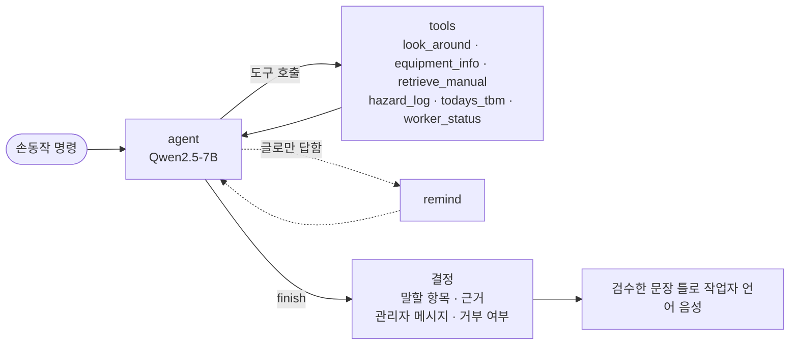

# 외국인 근로자를 위한 바디캠 안전관리 에이전트 · Isaac Sim

작업자가 가슴에 바디캠을 차고있을때, 화면에 보이는 물체의 위험 여부를 실시간으로 판정하고 작업자 언어로 안내하는 안전관리 에이전트입니다.

<p align="center"></p>

제4회 경남AI·SW경진대회 (③ 제조·피지컬 AI Agent) 출품작 · IBDP 팀 (문상균, 이승혜, 조현준)

---

## 개요

- YOLO26s가 바디캠 화면의 물체마다 위험/안전 상태를 판정합니다.
- 에이전트가 판정을 위험물 대장에 모으고, 위험 영역 설정과 접근 음성 경고를 합니다.
- 작업자가 손가락 1~3개를 보이면 장비 질의, 다국적 TBM,관리자 연결 및 SOS를 4개 언어(한국어, 영어, 중국어, 일본어) 음성으로 처리합니다.
- 손동작 요청과 재판단은 로컬 LLM(LangGraph + Qwen2.5-7B)이 도구를 호출해 결정하고, 장비 설명은 검증된 안전 매뉴얼(RAG)에 근거합니다.
- 작동 중인 컨베이어의 끼임 위험을 감지해 최고 등급 경보를 냅니다.
- 학습 데이터는 Isaac Sim으로 합성하고, 물체마다 미리 만든 정답표로 판정 결과를 채점합니다.

Isaac Sim에서는 평가 재현을 위해 작업자가 정해진 경로를 걷고, 실제 현장에서는 업무 중 상시 착용을 전제로 합니다.

---

## 주요 기능

| 기능 | 내용 | 스크립트 | 실행 환경 |
|---|---|---|---|
| 에이전트 실행 | 바디캠 판정, 2단계 분류, 재관측 재판단, 위험 영역, 음성 경고, 조치 지시서, 채점 | `run_patrol.py` | Isaac Sim |
| 손동작 명령 | 손가락 1~3 명령, 작업자 언어 음성 | `run_patrol.py --story`, `test_gestures.py` | Isaac Sim + `.venv-assistant` |
| LLM 에이전트 | LangGraph + 로컬 Qwen2.5-7B (Ollama), 손동작 요청과 재관측 재판단 | `llm_agent.py`, `recheck_agent.py` | `.venv-assistant` + Ollama |
| 매뉴얼 RAG | 검증된 안전 매뉴얼 근거로 장비 설명과 조치 문구 작성 | `manuals.py`, `report_agent.py` | `.venv-assistant` + Ollama |
| 끼임 위험 경보 | 작동 중인 컨베이어 롤러 1.5 m 위험구역, 손끝 10 cm 이내 최고 등급 경보 | `run_patrol.py --pinch-demo` | Isaac Sim |
| 시나리오 평가 | 시드별 실행, 프레임 원시판정 / 규칙 에이전트 / LangGraph 에이전트 3열 비교 | `eval_patrol.py` | 일반 파이썬 (내부 Isaac) |
| 시연 영상 | 녹화 화면과 에이전트 기록으로 1920x1080 영상 생성 | `make_video.py` | 일반 파이썬 |
| 제출 문서 | 개발완료보고서, 기술설명서, 발표자료 | `make_docs.py`, `make_slides.py` | 일반 파이썬 |
| 전체 시연 | Isaac 창을 단계별로 실행하고 조치 지시서 열기 | `demo_all.py` | 일반 파이썬 (내부 Isaac) |

---

## 학습 흐름

```
 1. 장면 + 정답표 ──► 2. 학습 데이터 (7700장) ──► 3. YOLO 학습 ──► 4. 에이전트 실행 ──► 5. 조치 지시서 + 채점
    build_scene         generate_dataset             train_yolo        run_patrol            eval_patrol
```

---

## 에이전트

<p align="center"></p>

카메라는 작업자 가슴의 바디캠 하나이며, 위험 판정과 접근 경고, 재판단을 모두 이 화면으로 처리합니다.

### 구성 요소

| 요소 | 구현 |
|---|---|
| 목표 | 바디캠에 보이는 위험물의 위험/안전 판정, 작업자 접근 경고, 조치 지시서 작성 |
| 계획 | 도면 기반 점검표 (소화기 6곳, 작업대 2곳), 오늘 TBM(`data/tbm_today.json`)의 작업 대상 물체를 거리 경고에서 제외 |
| 판단 | 후보 클래스에 고위험이 있으면 즉시 위험 확정, 저위험 후보만 있으면 주의로 분류 |
| 도구 | 바디캠, YOLO, 바닥 투영 거리 계산, 음성 경고, 조치 지시서(HTML), 매뉴얼 RAG |
| 기억 | 위험물 대장 (위치, 출처별 판정 표, 확신도, 본 횟수, 접근 경고 횟수, 상태) |
| 피드백 | 주의 물체를 같은 자리에서 다시 포착하면 이전·새 증거를 합쳐 LLM이 재판단, 재관측되지 않은 물체는 조치 지시서에 현장 확인 권고로 표시 |

### 판정 기준 예시 (`HAZARD_SEVERITY`, `agent.py`)

| 클래스 | 심각도 | 판정이 엇갈릴 때 |
|---|:-:|---|
| `spill` 유출, `stack_unstable` 불안정 적재 | high | 즉시 위험 확정 |
| `ext_fallen` 쓰러진 소화기 | high | 즉시 위험 확정 |
| `ext_blocked` 가로막힌 소화기, `tool_floor` 방치된 공구 | low | 주의로 분류 후 재관측 때 재판단 |

### 위험 영역 설정 (`zones.py`)

회피형 위험(`AVOIDANCE_HAZARDS`: 유출, 불안정 적재, 방치된 공구)만 영역 근거로 씁니다. 소화기 관련 항목은 조치 지시서에 올립니다.

| 근거 | 영역 |
|---|---|
| 라바콘 | 3 m 안으로 이어진 라바콘 2개 이상을 한 영역으로 묶음 (볼록 다각형 + 0.3 m) |
| DANGER 표지 | 표지 주변 1.2 m, 가까운 라바콘 영역이 있으면 합침 |
| 에이전트 판단 | 방치된 유출 1.3 m, 불안정 적재 1.6 m, 통로 공구, 3 m 안의 위험물은 한 영역 |

### 음성 경고 (`voice.py`)

| 구분 | 조건 | 안내 |
|---|---|---|
| 위험 | 회피형 위험 1.5 m 이내 또는 위험 영역 경계 0.5 m 이내 | "경고! 경고! 멈추세요! 위험 요소가 식별되었습니다." + 강한 진동 |
| 주의 | 주의 물체에 같은 조건으로 접근 | "주의하세요. 발밑을 확인하세요." + 짧은 진동 1회 |

- 1.5 m는 보행 속도 1.25 m/s 기준으로 도착까지 1.2초를 확보하는 거리입니다.
- 같은 대상은 12초, 경고끼리는 5.5초 간격을 둡니다.
- 오늘 TBM 작업 대상 물체는 경고에서 제외합니다.

### 공구 판단

YOLO가 공구 종류(8종)를 구분하고, 위험/안전은 놓인 자리로 판단합니다. 공구 박스 아래쪽을 작업대로 구분해 작업대 위면 정리된 공구, 아니면 통로에 방치된 공구로 분류합니다. 조치 지시서에는 "통로에 방치된 공구 (망치, 삽)"처럼 공구 이름까지 표시합니다.

### 에이전트 기록 예시

```
[00:12] <판정> 바디캠 유출(방치)  |  서쪽 통로  |  YOLO 91%  → 대장 F03
[00:19] <주의> F07 잠깐 보고 지나침 → 주의로 분류 (가로막힌 소화기), 다시 보이면 재판단
[00:19] <위험 영역> Z02 F03 주변 (서쪽 통로, 반지름 약 1.3 m) → 미끄럼 위험, 위험 영역으로 설정
[00:24] <음성 경고> "경고! 경고! 멈추세요! 위험 요소가 식별되었습니다." ← 작업자 ↔ F03 방치된 유출 1.2 m
[00:41] <LLM 판단> qwen2.5:7b: evidence → retrieve_manual → finish | 소화기 앞이 상자로 막혀 있음
[00:41] <판정> F07 재관측 재판단 → 위험 가로막힌 소화기
```

---

## 손동작 명령 (비언어적 표현)

작업자가 멈춰 서서 손을 바디캠 앞으로 들어 손바닥을 보이고 손가락을 폅니다.

| 손가락 | 명령 | 동작 |
|:-:|---|---|
| 1 (검지) | 장비 설명 | 직전 화면 가운데의 장비(운반 카트, 공구, 소화기 등) 이름, 안전 사용법, 현재 상태. 매뉴얼 근거가 없으면 관리자 호출로 연결 |
| 2 (+중지) | 오늘의 TBM | 오늘 작업, 주의할 위험, 지킬 것, 지난 조치 |
| 3 (+약지) | 관리자 호출 및 SOS 신고 | 경보음, 위치와 바디캠 화면을 관리자·안전팀에 전달 |

### 손동작 인식 (`hand_count.py`)

- MediaPipe Hands의 손 관절 21점으로 손가락별 마디 각도와 손목 거리로 판별합니다.
- 화면 방향을 쓰지 않아 손이 기울어도 인식합니다.
- 멈춘 손에서 같은 수가 3번 연속 나오면 명령을 실행하고, 손을 내린 뒤 다음 명령을 받습니다.

### LLM 에이전트 (`llm_agent.py`)

명령이 들어오면 현재 상황(최근 바디캠 물체, 위험물 대장, 위험 영역, 오늘 TBM, 작업자 위치)을 넘기고, 로컬 Qwen2.5-7B가 LangGraph 그래프에서 도구를 호출한 뒤 `finish`로 결정합니다. Ollama로 실행해 인터넷과 API 키가 필요 없습니다.



| 도구 | 기능 |
|---|---|
| `look_around` | 최근 바디캠에 보인 물체 (번호, 이름, 거리, 방향, 화면 가운데와의 거리) |
| `equipment_info(id)` | 물체 설명과 안전 사용법 |
| `retrieve_manual(query)` | 안전 매뉴얼 RAG 검색 (`manuals.py`, `data/manuals/*.md`) |
| `hazard_log(limit)` | 위험물 대장 (우선순위, 구역, 작업자와의 거리) |
| `todays_tbm` / `worker_status` | 오늘 TBM / 작업자 위치·구역 |
| `finish(say_ids, reason_ko, manager_ko, refuse)` | 말할 항목, 한국어 근거, 관리자 메시지, 거부 여부 |

- LLM은 말할 항목만 고르고, 안내 문장은 검수한 문장 틀로 만듭니다.
- 판단 근거는 기록에 `LLM 판단`으로, 관리자 메시지는 확인된 사실 뒤에 `AI 요약`으로 남깁니다.
- `--llm off`로 규칙 기반 결정을 쓸 수 있습니다.

### 재판단 에이전트 (`recheck_agent.py`)

- 주의 물체를 바디캠이 같은 자리에서 다시 포착할 때 실행합니다.
- `evidence`로 이전·새 관측, 경과 시간, 구역을 보고, 필요하면 `retrieve_manual`로 근거를 찾은 뒤 `finish(confident, verdict_class, reason_ko)`로 위험/안전을 확정합니다.
- `--recheck-llm off` 또는 `--agent rule`이면 규칙(고위험 후보 재검토)으로 판단합니다.

### 언어와 음성

- 안내 문장은 사람이 검수한 4개 언어 문장 틀과 현장 용어집으로 만들고, 관리자용 한국어 기록을 함께 남깁니다.
- 음성은 edge-tts(Microsoft 신경망 음성)를 쓰고, Windows 음성으로도 재생합니다. 만든 음성은 문장별로 저장해 다시 씁니다.
- 손 인식, 음성, LLM은 `.venv-assistant`의 `scripts/assistant_worker.py`가 별도 프로세스로 처리합니다.
- 시뮬레이션에서는 `walk_anim.py`가 작업자 뼈대에 손가락 1~3 자세를 만듭니다 (팔 2관절 IK, 손바닥이 카메라를 향하도록 회전).

### 시연 시나리오 (`story.py`, `run_patrol.py --story`)

시연 작업자 언어는 영어이고, 에이전트는 바디캠 화면과 손동작으로만 상황을 파악합니다.

1. 시작과 함께 손가락 2: 오늘의 TBM
2. 걷는 동안 위험/안전 판정, 위험 영역 설정, 접근 음성 경고
3. 북쪽 보관 구역의 운반 카트 앞에서 손가락 1: `look_around`, `equipment_info`로 카트 사용법 안내
4. 팔레트의 상자 4개를 카트에 싣고 이동
5. 한 바퀴 뒤 손가락 3: 관리자 호출·SOS (위치, 가까운 위험, LLM 요약, 경보음)

### 조치 지시서

- 파일: `outputs/agent/dashboard_seed<시드>.html` (시연은 `dashboard_story_seed5.html`)
- 내용: 평면도(우선순위 번호, 위험 영역), 조치 목록(긴급/높음/보통, 위치, 조치 방법, 근거), 음성 경고 기록, 점검표, 에이전트 기록
- 우선순위 점수: 위험 종류별 심각도 + 접근 경고 횟수 × 2
- 조치 문구: 기본은 `ACTIONS` 테이블이고, `--report-llm` 사용 시 `report_agent.py`가 매뉴얼 근거로 보강하고 출처를 표시합니다.
- 녹화 화면 하단 배지에 처리 경로(LLM 재판단 / 규칙)와 상태 전환을 표시합니다.

---

## YOLO 클래스 구분 학습

같은 종류의 물체를 위험한 상태와 안전한 상태로 함께 배치해, YOLO가 상태까지 구분하도록 학습합니다.

| 종류 | 위험 | 안전 | 에셋 |
|---|---|---|---|
| 바닥 유출 | `spill` 기름/물 웅덩이 + 쓰러진 통 | `spill_marked` 미끄럼 주의 표지판, 라바콘 설치 | 웅덩이는 광택 재질 직접 제작, 통·표지판·라바콘은 NVIDIA |
| 공구 | `tool_floor` 통로 바닥에 방치 | `tool_stored` 작업대 위 정리 | YOLO는 8종(`hammer` `screwdriver` `saw` `power_saw` `pickaxe` `shovel` `wrench` `drill`) 구분, Poly Haven 스캔(CC0), 전동톱 직접 모델링, YCB 드릴 |
| 적재 | `stack_unstable` 맨 위 층이 기울고 팔레트 밖으로 나옴 | `stack_stable` 반듯하게 쌓인 상자 | NVIDIA 팔레트, 골판지 상자 |
| 소화기 | `ext_fallen` 쓰러짐, `ext_blocked` 앞이 가로막힘 | `ext_ok` 제자리 비치 | NVIDIA 소화기 |
| 작업자 | `worker` (거리 계산용) | | NVIDIA 건설 작업자 + 직접 만든 걷기 동작 |
| 위험 영역 표시 | `cone` 라바콘, `danger_sign` DANGER 표지 | | NVIDIA 라바콘, 표지 직접 모델링 |
| 장비 | | `cart` 운반 카트 (손가락 1 안내 대상) | Poly Haven 핸드트럭(CC0), 창고 평판 카트 |

시나리오마다 무작위로 배치합니다.

| 항목 | 배치 |
|---|---|
| 위험 영역 | 2곳 (라바콘 링 4~6개 60%, DANGER 표지 40%), 경로에서 경계까지 0.4~0.9 m |
| 유출 | 3곳 (45% 조치됨) |
| 통로 공구 | 2~3곳 (1~3개씩, 종류 무작위) |
| 작업대 | 2개 |
| 팔레트 | 4곳 (절반 불안정) |
| 소화기 | 6곳 (정상 60%, 쓰러짐 20%, 가로막힘 20%) |

경로 바로 옆(0.4~0.5 m)에 위험물을 하나 두어 접근 음성 경고를 시험합니다.

---

## 판정과 채점

- 판정: 바디캠 YOLO 추적(ByteTrack)으로 같은 물체에 번호를 붙이고, 3프레임 이상 같은 판정이면 위험/안전을 알립니다. 가까이서 보거나 재관측으로 판정이 바뀌면 다시 알립니다.
- 정답표: 시나리오를 만들 때 물체마다 id, 클래스, 위험 여부, 위치, 구역을 `outputs/eval/answer_key_seed<시드>.json`에 저장합니다.
- before (프레임 원시판정): `BodycamInspector`가 매 프레임 Replicator 정답 박스와 YOLO 박스를 맞춰 물체별 투표를 정답과 비교합니다.
- after (에이전트 최종 대장): 2단계 분류, 재관측 재판단, 점검표를 거친 최종 대장을 창고 전체 물체와 위치·종류로 비교합니다.
- 두 단계는 집계 단위가 달라 `false_hazard_boxes`(before, 박스 수)와 `false_reports`(after, 보고 건수)로 따로 표시합니다.
- `eval_patrol.py --agent both`는 프레임 원시판정 / 규칙 에이전트 / LangGraph 에이전트 3열과 재판단 건수(`caution_rejudged`, `caution_rejudged_confirmed`)를 함께 보여줍니다.

---

## 결과

### YOLO

YOLO26s, 960 px, 19클래스, 합성 데이터 7700장 (일반 촬영 5000장, 공구 근접 1500장, 운반 카트 1200장)

| 클래스 | mAP50 | 클래스 | mAP50 | 클래스 | mAP50 |
|---|:-:|---|:-:|---|:-:|
| `spill` | 0.920 | `spill_marked` | 0.937 | `worker` | 0.950 |
| `stack_unstable` | 0.957 | `stack_stable` | 0.960 | `cone` | 0.976 |
| `ext_fallen` | 0.907 | `ext_ok` | 0.938 | `danger_sign` | 0.950 |
| `ext_blocked` | 0.909 | `hammer` | 0.862 | `screwdriver` | 0.828 |
| `saw` | 0.806 | `power_saw` | 0.901 | `pickaxe` | 0.845 |
| `shovel` | 0.819 | `wrench` | 0.887 | `drill` | 0.915 |
| `cart` | 0.794 | | | | |

| 지표 | 값 |
|---|:-:|
| mAP50 | 0.898 |
| mAP50-95 | 0.689 |
| 정밀도 | 0.920 |
| 재현율 | 0.827 |

<p align="center"> </p>

학습된 가중치는 `outputs/yolo/warehouse_v3/weights/best.pt`에 있어 데이터 생성과 학습 없이 바로 실행할 수 있습니다.

실제 사진 시험(`detect_image.py`): 책상 위 공구를 위에서 가까이 찍은 휴대폰 사진 3장(커터칼, 일자 드라이버, 가위)에서 학습한 클래스인 드라이버를 놓치고 손잡이를 작업자로 봤습니다.
학습 데이터의 드라이버는 화면의 0.05~4% 크기(바디캠으로 1~5 m 앞 바닥)인데 이 사진은 화면의 13%를 채워서, 현장 적용 전에 현장 사진으로 미세조정이 필요합니다.

### 손동작 명령 (`test_gestures.py`)

경로 8곳 × 손가락 1~3, 곳마다 조명을 무작위로 바꾸고, 손을 올렸다 내리는 동안의 화면(0.1초 간격)을 명령 확정 필터로 채점했습니다.

| 항목 | 결과 |
|---|:-:|
| 보인 손가락 수대로 명령 실행 | 21/24 |
| 다른 명령 실행 | 2 (spot5에서 손가락 2→1, 3→2: 그 자리 조명에서 중지 관절을 접힌 것으로 봄) |
| 명령 누락 | 1 (spot0 손가락 1: 끝까지 안정되지 않음) |
| 손을 다 올린 화면의 손가락 수 정확도 | 269/312 |
| 손을 올리고 내리는 중 오작동 | 0 (움직이는 중 다른 수로 보인 화면 334개 중 17개는 멈춘 손만 확정하는 필터가 거름) |

`score_gestures.py`로 저장한 시험 화면(`--raw`)을 Isaac 없이 다시 채점할 수 있습니다. JPEG로 저장한 화면이라 실시간 시험과 한두 번 다를 수 있습니다.

### 평가 결과 파일

| 파일 | 내용 |
|---|---|
| `outputs/eval/patrol_results.md` | 시나리오별 표 (`--agent both`는 `patrol_results_compare.md`) |
| `outputs/eval/inspection_seed<시드>.json` | 물체별 판정 |
| `outputs/agent/dashboard_seed<시드>.html` | 조치 지시서 |

시드당 약 5분이 걸립니다. 옛 CCTV 기반 결과는 `outputs/eval/_legacy_pre_cctv_removal/`에 있습니다.

---

## 끼임 위험 경보

작동 중인 기계의 끼임 위험을 정적 위험물과 별도로 다룹니다.

- 작동 중인 기계의 끼임점 반경 1.5 m를 위험구역으로 설정하고, 기계가 멈추면 해제합니다.
- 검지 끝과 끼임점의 3D 거리가 10 cm 이내면 최고 등급 경보("손 빼세요")를 냅니다.
- 기계 작동 상태는 IoT/PLC 신호 조회 방식의 `get_machine_state(machine_id)`로 받습니다.

| 구성 | 구현 |
|---|---|
| 장면 | 컨베이어 롤러 1대 (`scene.py:add_machine`), 진입 롤러에 `pinch_point` 라벨과 안전색 노랑 적용 |
| 기계 상태 | `machines.py` (`MachineRegistry`, 기본값 off) |
| 판단 | `agent.py` (`_on_machine_change`, `check_pinch`, `machine_report`), 위험구역은 기존 경고 체계(`_check_warnings`)에 포함 |
| 3D 위치 | 바디캠 `distance_to_image_plane` 어노테이터로 손 관절(검지 끝)과 `pinch_point` 박스를 역투영 (`geometry.Projector.unproject`, `pinch_detect.py`) |
| 보조 위치 | 끼임점이 탐지되지 않으면 등록 위치(`warehouse.MACHINE_CONVEYOR`)로 계산하고 로그와 집계(`pinch_fallback`)에 기록 |
| 조치 지시서 | 기계 ID, 상태, 위험구역 접근·끼임 경보 횟수를 "끼임 위험 기계" 카드로 표시 |
| 손가락 1 | 컨베이어를 가리킨 후 손동작 인식 시 안전수칙 안내 (`data/manuals/conveyor.md`, `i18n.INFO["machine_conveyor"]`) |
| 테스트 | 6개 (기계 on/off 위험구역, 위험구역 경고, 10 cm 경보, 정지 시 무경보, 보조 위치 계산) |

### 학습 데이터와 결과

- 데이터: `generate_pinch_dataset.py`, 끼임점 주변 0.5~3.2 m, 높이 0.5~1.9 m 전 방위 촬영, 조명 무작위화, 블러·노이즈, 30% 확률로 가림 상자 배치
- 모델: YOLO26n, 960 px, 1800장 (학습 1543 / 검증 257, 라벨 1353장)

| 지표 | 값 |
|---|:-:|
| Precision | 0.983 |
| Recall | 0.910 |
| mAP50 | 0.966 |
| mAP50-95 | 0.760 |

6 epoch에 수렴해 종료. 가중치는 `outputs/yolo/pinch_v1/weights/best.pt`, 지표는 `outputs/yolo/pinch_v1/metrics.json`에 있습니다.

### Isaac Sim 종단 검증

`run_patrol.py --pinch-demo --record`(headless, GPU 렌더링)로 기계 작동, 위험구역 진입 음성 경고, 끼임 경보, 기계 정지 후 위험구역 해제까지 전 과정을 확인했고, 로그와 `state.jsonl`에 기록했습니다.

---

## 폴더 구조

```
factory-safety-isaac/
├── README.md
├── requirements.txt          일반 파이썬 패키지 (YOLO 학습, 평가, 테스트)
├── docs/                     구조도, 평면도, YOLO 혼동 행렬과 학습 곡선, 보고서 그림
├── factory_safety/           핵심 패키지
│   ├── config.py             클래스 (위험/안전, 공구 8종, 라바콘·표지), 에셋 주소, 경고 거리
│   ├── warehouse.py          (핵심) 창고 배치: 경로, 물체 자리, 작업대, 구역 이름
│   ├── scenario.py           (핵심) 위험/안전 물체 무작위 배치 + 정답표
│   ├── scene.py              USD 장면: 창고, 물체 묶음 + 의미 라벨, 작업자, 바디캠
│   ├── walk_anim.py          작업자 걷기 동작과 손동작 자세
│   ├── walker.py             경로 걷기 + 가슴 바디캠 흔들림
│   ├── agent.py              (핵심) 안전 에이전트: 점검표, 위험물 대장, 2단계 분류, 재판단, 위험 영역, 음성 경고, 조치 지시서, 채점
│   ├── zones.py              위험 영역 (라바콘, DANGER 표지, 에이전트 판단)
│   ├── voice.py              음성 경고 (경보음 + 위험/주의 문구)
│   ├── overlay.py            박스, 한국어 이름, 손 관절, 처리 경로 배지 그리기
│   ├── assistant.py          손동작 명령 1~3 실행 (장비 설명, TBM, 관리자 호출·SOS)
│   ├── llm_agent.py          [.venv-assistant] 손동작 LLM 에이전트 (LangGraph + Qwen2.5-7B, 도구 6개)
│   ├── manuals.py            [.venv-assistant] 매뉴얼 RAG (청크, 로컬 임베딩, 벡터스토어, 검색)
│   ├── recheck_agent.py      [.venv-assistant] 재관측 재판단 LLM 에이전트
│   ├── report_agent.py       [.venv-assistant] 조치 문구 매뉴얼 근거 보강 LLM 에이전트
│   ├── story.py              시연 시나리오
│   ├── assistant_client.py   손 인식·음성 도우미 프로세스 연결
│   ├── hand_count.py         손 관절 21점 → 손가락 수, 연속 확인
│   ├── i18n.py               4개 언어 문장 틀, 현장 용어집, TBM 항목
│   ├── dashboard.py          조치 지시서 HTML
│   ├── inspection.py         바닥 투영, 바디캠 프레임 채점
│   ├── detector.py           YOLO 래퍼 (ByteTrack 추적)
│   ├── dataset.py            학습 데이터 촬영 시점, 후처리, YOLO 형식
│   ├── machines.py           끼임 위험 기계 작동 상태 (MachineRegistry, get_machine_state)
│   ├── pinch_detect.py       바디캠 depth + 손 관절로 손끝·끼임점 3D 위치 계산
│   ├── geometry.py           카메라 투영, 회전, 역투영
│   ├── isaac_utils.py        Isaac Sim 버전 호환, Replicator 도우미
│   └── report.py             터미널 로그
├── scripts/
│   ├── get_assets.py         [파이썬] Poly Haven 공구 모델 받기
│   ├── build_scene.py        [Isaac] 장면 + 정답표
│   ├── generate_dataset.py   [Isaac] YOLO 합성 데이터
│   ├── generate_pinch_dataset.py [Isaac] 끼임점 합성 데이터
│   ├── run_patrol.py         [Isaac] 에이전트 실행, 조치 지시서, 채점 (--story 시연)
│   ├── test_gestures.py      [Isaac] 손동작 인식 시험
│   ├── score_gestures.py     [.venv-assistant] 저장한 시험 화면 재채점
│   ├── assistant_worker.py   [.venv-assistant] MediaPipe 손 인식 + 다국어 음성 + LLM 에이전트
│   ├── train_yolo.py         [파이썬] YOLO 학습
│   ├── val_yolo.py           [파이썬] YOLO 검증 (metrics.json)
│   ├── compare_yolo.py       [파이썬] YOLO 가중치 비교
│   ├── eval_patrol.py        [파이썬] 여러 시나리오 평가, 3열 비교
│   ├── demo_all.py           [파이썬] 전체 시연
│   ├── make_video.py         [파이썬] 시연 영상
│   ├── make_figures.py       [파이썬] 구조도, 흐름도
│   ├── pick_figures.py       [파이썬] 녹화에서 보고서 그림 고르기
│   ├── make_docs.py          [파이썬] 개발완료보고서, 기술설명서 (docx)
│   ├── make_slides.py        [파이썬] 발표자료 (pptx)
│   ├── to_pdf.ps1            [PowerShell] docx, pptx → PDF
│   └── plot_layout.py        [파이썬] 평면도
├── data/tbm_today.json       오늘 TBM (작업, 위험, 지킬 것, 지난 조치)
├── data/manuals/*.md         안전 매뉴얼 RAG 원문 (공구, 카트, 적재, 유출, 소화기, 위험구역, 컨베이어)
├── tests/test_core.py        Isaac 없이 실행하는 테스트
└── outputs/                  결과물 (eval/ 채점 결과, agent/ 조치 지시서, yolo/ 가중치)
```

(핵심) 표시 파일을 고치면 경로, 물체 자리, 배치 확률이 장면, 학습 데이터, 에이전트, 채점에 함께 반영됩니다.

**`_legacy_pre_cctv_removal/` 폴더 관례**: 구조를 크게 바꿀 때(예: CCTV 제거) 지금 코드와 안 맞게 된 결과물은 지우지 않고
`outputs/eval/_legacy_pre_cctv_removal/`, `submission/_legacy_pre_cctv_removal/`, `docs/_legacy_pre_cctv_removal/` 처럼 같은 이름의 하위 폴더로 옮겨 둡니다.
평가·제출 문서 스크립트는 이 폴더를 보지 않으므로 최신 결과와 섞이지 않고, 과거 수치가 왜 다른지 추적할 때만 참고합니다.

---

## 설치

| 항목 | 내용 |
|---|---|
| Isaac Sim | 6.0.1 (pip 설치) · [공식 문서](https://docs.isaacsim.omniverse.nvidia.com/) |
| GPU | RTX 계열 NVIDIA GPU (확인 환경: RTX 4060 Ti 16 GB) |
| 인터넷 | NVIDIA 에셋 서버에서 창고와 소품 로드 |
| 일반 파이썬 | 3.12 |

```powershell
cd C:\dev\factory-safety-isaac          

# 1) Isaac Sim 6.x 가상환경 (Python 3.12)
py -3.12 -m venv .venv-isaac
.venv-isaac\Scripts\python -m pip install --upgrade pip
.venv-isaac\Scripts\python -m pip install "isaacsim[all,extscache]==6.0.1.0" --extra-index-url https://pypi.nvidia.com
setx ISAACSIM_PYTHON "C:\dev\factory-safety-isaac\.venv-isaac\Scripts\python.exe"
# Isaac 안에서 YOLO와 추적 실행 (Isaac의 torch 유지)
.venv-isaac\Scripts\python -m pip install --no-deps ultralytics==8.4.166 ultralytics-thop polars lap

# 2) 학습용 가상환경
py -3.12 -m venv .venv
.venv\Scripts\python -m pip install -r requirements.txt
# GPU 학습용 CUDA torch
.venv\Scripts\python -m pip install torch==2.14.0 torchvision==0.29.0 --index-url https://download.pytorch.org/whl/cu126 --force-reinstall --no-deps

# 3) 손동작·다국어 음성·LLM 도우미 (별도 가상환경)
py -3.12 -m venv .venv-assistant
.venv-assistant\Scripts\python -m pip install mediapipe edge-tts imageio-ffmpeg langgraph langchain-ollama langchain-chroma chromadb

# 4) 로컬 LLM과 매뉴얼 RAG 임베딩 (인터넷·API 키 불필요)
winget install Ollama.Ollama
ollama pull qwen2.5:7b
ollama pull nomic-embed-text
```

- Isaac Sim 첫 실행 때 NVIDIA Omniverse 라이선스(EULA) 동의를 묻습니다. `Yes`를 입력하거나 환경 변수 `OMNI_KIT_ACCEPT_EULA=YES`를 설정합니다.
- `setx` 뒤에는 VSCode를 다시 시작해야 환경 변수가 적용됩니다.
- 설치 확인: `.venv\Scripts\python -m pytest tests -q` → `35 passed`

---

## 빠른 시작

```powershell
# 0) 공구 모델 받기 (Poly Haven, 처음 한 번)
.venv\Scripts\python scripts/get_assets.py

# 1) 장면 확인 (위에서 본 창고, 정답표 저장)
& $env:ISAACSIM_PYTHON scripts/build_scene.py

# 2) 학습 데이터 생성 + YOLO 학습 (약 2시간, 학습된 가중치 포함이라 생략 가능)
& $env:ISAACSIM_PYTHON scripts/generate_dataset.py --num 5000 --scenario-every 40 --seed 7
& $env:ISAACSIM_PYTHON scripts/generate_dataset.py --num 1500 --scenario-every 30 --seed 11 --focus tools --prefix wt --out outputs/dataset_tools
& $env:ISAACSIM_PYTHON scripts/generate_dataset.py --num 1200 --scenario-every 30 --seed 21 --carts 2 --focus cart --prefix wc --out outputs/dataset_cart
.venv\Scripts\python scripts/train_yolo.py --data outputs/data_v3.yaml --epochs 80
.venv\Scripts\python scripts/val_yolo.py

# 3) 에이전트 실행 (바디캠 화면 / 위에서 본 화면 / 시연 시나리오 / 끼임 경보 시연)
& $env:ISAACSIM_PYTHON scripts/run_patrol.py
& $env:ISAACSIM_PYTHON scripts/run_patrol.py --view top
& $env:ISAACSIM_PYTHON scripts/run_patrol.py --story --seed 5
& $env:ISAACSIM_PYTHON scripts/run_patrol.py --pinch-demo

# 4) 여러 시나리오 채점, 전체 시연
.venv\Scripts\python scripts/eval_patrol.py --seeds 0 1 2 3 4
.venv\Scripts\python scripts/eval_patrol.py --seeds 0 1 2 --agent both
.venv\Scripts\python scripts/demo_all.py

# 5) 시연 영상: 창 없이 녹화 (약 5분) → 영상 합치기
& $env:ISAACSIM_PYTHON scripts/run_patrol.py --headless --sim-dt 0.0333333 --seed 5 --yolo-every 3 --story --sound off --record outputs/record/seed5 --result outputs/record/seed5_result.json
.venv\Scripts\python scripts/make_video.py

# 6) 제출 문서 (팀 양식 ..\조현준_IBDPppt양식.pptx가 있으면 그 양식 사용)
.venv\Scripts\python scripts/pick_figures.py
.venv\Scripts\python scripts/make_docs.py
.venv\Scripts\python scripts/make_slides.py
powershell -ExecutionPolicy Bypass -File scripts/to_pdf.ps1
```

VSCode에서는 `Ctrl+Shift+P` → Tasks: Run Task에서 위 작업을 바로 실행할 수 있습니다.

---

## 스크립트 옵션

<details>
<summary><b>run_patrol.py</b></summary>

| 옵션 | 기본값 | 설명 |
|---|---|---|
| `--weights` | `outputs/yolo/warehouse_v3/weights/best.pt` | YOLO 가중치 |
| `--seed` | 무작위 | 위험 요소 배치 시드 |
| `--laps` | `1` | 경로 반복 횟수 (한 바퀴 59 m, 약 47초) |
| `--view` | `bodycam` | `bodycam` / `top` |
| `--sim-dt` | `0` | 0보다 크면 프레임마다 고정 시간 (평가 재현용, 예 `0.0333`) |
| `--yolo-every` | `6` | YOLO 실행 간격 (프레임) |
| `--record` | | 바디캠 화면과 에이전트 상태 저장 폴더 (`make_video.py` 입력) |
| `--story` | | 시연 시나리오 (손 인식 켬, 음성 경고 1회) |
| `--llm` | `qwen2.5:7b` | 손동작 요청 판단 모델, `off`면 규칙 |
| `--recheck-llm` | `qwen2.5:7b` | 재관측 재판단 모델, `off`면 규칙 |
| `--agent` | `langgraph` | `langgraph` / `rule` (`eval_patrol.py --agent both` 비교용) |
| `--report-llm` | `qwen2.5:7b` | 조치 문구 보강 모델, `off`면 고정 문구(`ACTIONS`) |
| `--voice-max` | 없음 (`--story`는 `1`) | 음성 경고 최대 횟수 |
| `--gestures` | `off` | `demo`: 손가락 3 → 1 → 2 → 4 → 5 순서로 실행, `watch`: 손 인식만 |
| `--lang` | `zh,en,ja` (`--story`는 `en`) | 작업자 언어 (`ko` `en` `zh` `ja`), 여러 개면 명령마다 순환 |
| `--sound` | `auto` | 음성 경고·안내 소리 (`auto`는 창이 있을 때만) |
| `--result` | `outputs/eval/inspection_seed<시드>.json` | 채점 결과 |
| `--pinch-weights` | `outputs/yolo/pinch_v1/weights/best.pt` | 끼임점 모델 가중치 |
| `--pinch-demo` | | 컨베이어(M1)를 켜고 가장 가까이 지날 때 끼임 경보를 보인 뒤 정지 |

실행 후 `outputs/agent/dashboard_seed<시드>.html`(조치 지시서)과 `outputs/agent/report_seed<시드>.json`(대장과 기록)이 생성됩니다. `--story`는 `dashboard_story_seed<시드>.html`, `report_story_seed<시드>.json`으로 저장합니다.
</details>

<details>
<summary><b>generate_dataset.py</b></summary>

| 옵션 | 기본값 | 설명 |
|---|---|---|
| `--num` | `500` | 이미지 수 |
| `--scenario-every` | `40` | 배치 변경 간격 (장) |
| `--rt-subframes` | `8` | 프레임당 렌더링 반복 |
| `--val-every` | `7` | 검증용 비율 (7장 중 1장) |
| `--no-light-random` `--no-post` | | 조명 무작위화 / 흔들림·노이즈 끄기 |
| `--gui` | | 촬영 장면 표시 |
| `--focus tools` / `cart` | | 공구 근접 촬영 / 운반 카트 근접 촬영 (`--carts 2`와 함께) |
| `--carts` | `0` | 배치마다 운반 카트 수 |
| `--prefix` `--out` | `wh` `outputs/dataset` | 파일 이름 접두어, 저장 폴더 |

- 촬영 시점: 바디캠(경로 위 1.2~1.55 m, 70%, 절반은 물체 방향), 자유 시점(물체 주변, 30%)
- 출력: `outputs/dataset/{images,labels}/{train,val}`, `data.yaml`, `README.txt`
</details>

<details>
<summary><b>train_yolo.py</b></summary>

| 옵션 | 기본값 | 설명 |
|---|---|---|
| `--data` | `outputs/data_v3.yaml` | 데이터 (일반 촬영 + 공구 근접 + 운반 카트, 19클래스) |
| `--model` | `yolo26s.pt` | 시작 가중치 |
| `--imgsz` | `960` | 입력 해상도 |
| `--epochs` | `100` | 처음부터 80, 이어 학습 40 |
| `--batch` | `16` | YOLO26s, 960 px 기준 약 11 GB |
| `--name` | `warehouse_v3` | 결과 `outputs/yolo/<n>/weights/best.pt` |
</details>

---

## 좌표계

NVIDIA `warehouse_multiple_shelves.usd` 기준입니다. 단위 미터, +Z 위, yaw 0 = +X, 반시계 방향이 +입니다.

| 항목 | 위치 |
|---|---|
| 벽 | y = -12 (남), 18 (북) |
| 랙 | 3줄, x = -9 / 0 / +9, y = -3.8 ~ 12.4 |
| 통로 | 서쪽 x ≈ -4.5, 동쪽 x ≈ +4.5 |

---

## 수정 가이드

| 대상 | 파일 |
|---|---|
| 경로 | `warehouse.py`의 `PATH_WAYPOINTS` |
| 물체 자리 | `warehouse.py`의 `SPILL_SLOTS`, `TOOL_FLOOR_SLOTS`, `STACK_SLOTS`, `TABLES`, `EXT_MOUNTS` |
| 배치 개수, 위험 확률 | `scenario.py`의 `sample_scenario()` |
| 물체 모양 | `scene.py`의 `_build_spill`, `_build_tool`, `_build_stack`, `_build_ext` |
| 근접 기록 거리 (평가용) | `config.py`의 `PROXIMITY_WARN_M` |
| 음성 경고 거리, 문구 | `config.py`의 `TOUCH_WARN_M`, `VOICE_TEXT_HAZARD`, `VOICE_TEXT_CAUTION` |
| 거리 경고·위험 영역 대상 | `agent.py`의 `AVOIDANCE_HAZARDS` |
| 즉시 확정/주의 분류 기준 | `agent.py`의 `HAZARD_SEVERITY` |
| TBM 작업 대상 제외 | `agent.py`의 `TBM_TASK_KIND`, `TBM_TASK_ZONE` |
| 오늘 TBM 내용 | `data/tbm_today.json` (항목 키는 `i18n.py`의 `TBM_ITEMS`, `ACTIONS`) |
| 안내 문장, 언어 추가 | `i18n.py`, 음성은 `assistant_worker.py`의 `VOICES` |
| 손가락 인식 기준 | `hand_count.py`의 `BEND_MAX`, `REACH_MIN`, `THUMB_OUT` |
| 위험 영역 크기 | `zones.py`의 `CONE_LINK_M`, `SIGN_RADIUS`, `AGENT_RADIUS` |
| 위험 영역 자리 | `warehouse.py`의 `ZONE_SLOTS` |
| 걷는 속도, 바디캠 높이 | `walker.py`의 `PathWalker` |
| 재판단 모델, 단계 수 | `recheck_agent.py`의 `MODEL`, `MAX_STEPS`, `run_patrol.py`의 `--recheck-llm`, `--agent` |
| 조치 방법, 심각도 | `agent.py`의 `ACTIONS`, `SAFE_NOTES` |
| 끼임 위험구역 반경, 경보 거리 | `config.py`의 `MACHINE_ZONE_M`, `PINCH_ALERT_M` |
| 끼임 위험 기계 위치·추가 | `warehouse.py`의 `MACHINE_CONVEYOR`, `MACHINES` |

새 위험 요소는 `config.py`의 `CLASSES`, `HAZARD`, `KIND`에 위험/안전 두 클래스를 추가하고, `warehouse.py`(자리), `scenario.py`(배치), `scene.py`(`_build_<종류>`), `agent.py`(`HAZARD_SEVERITY`, `AVOIDANCE_HAZARDS`) 순서로 반영한 뒤 `pytest`로 확인합니다.

---

## Isaac Sim 6.0 구현 사항

| 항목 | 구현 |
|---|---|
| Replicator 라벨 | 배치를 첫 렌더 전에 모두 만들고 표시/숨김으로 전환 (`WarehouseScene.add_scenario`) |
| 라벨 정리 | NVIDIA 소품에 들어 있는 기존 라벨을 `scene.strip_semantics()`로 정리 |
| 화면 렌더 | 화면이 필요한 프레임은 `rep.orchestrator.step()`으로 렌더, `rt_subframes` 2 이상 |
| 작업자 동작 | `walk_anim.py`가 허벅지, 정강이, 팔 방향을 매 프레임 계산해 걷기 동작 생성 |
| GPU 메모리 | render product 하나를 계속 사용 |
| 실행 환경 분리 | Isaac(`.venv-isaac`), 학습(`.venv`), 손 인식·음성·LLM(`.venv-assistant`) |
| LLM 실행 | Ollama가 꺼져 있거나 모델이 없으면 규칙으로 동작 (`ollama pull qwen2.5:7b` 후 다시 실행) |
| LangGraph 설치 위치 | `.venv-assistant`에만 설치 (`.venv-isaac`에 깔면 Isaac이 고정한 `idna`, `typing_extensions`, `websockets` 버전이 바뀜) |

---

## 검증

| 항목 | 결과 |
|---|---|
| 단위 테스트 (배치, 정답표, 경로, 판정·채점, 바닥 투영, USD 장면, 에이전트, 위험 영역, 음성 경고, 공구 자리, 손가락 세기, 다국어 문장, 손동작 자세, 시연 시나리오, 카트 추적, LLM 결정 반영, 끼임 경보) | 35개 통과 |
| Isaac Sim 6.0.1 장면, 라벨, 작업자 걷기 (RTX 4060 Ti 16 GB, Windows 11) | 완료 |
| 합성 데이터 7700장 (19클래스), YOLO 학습 | 완료 |
| 손동작 명령 (경로 8곳 × 손가락 1~3) | 21/24 |
| LLM 에이전트 (Qwen2.5-7B 도구 호출) + 시연 시나리오 (손동작 3개) | 재확인 필요 (옛 수치 4/4는 손동작 4개 체계 기준) |
| 순찰 채점 (바디캠 단독 + 2단계 분류 + 재관측 재판단) | 재실행 필요 (`eval_patrol.py --agent both`) |
| 끼임 위험 경보 Isaac Sim 종단 검증 | 완료 |
| 실제 현장 사진 | 아직 안 함 (휴대폰 공구 사진 3장 시험만) |

---

## 향후 계획

- 실제 현장 영상으로 YOLO 미세조정
- Isaac Sim 6.1 사고 이벤트 확장(넘어짐, 유출, 화재)으로 동적 사고 데이터 추가
- 바디캠 시점을 XR로 연결한 작업자 시점 안전 교육

---

## 사용한 기술

- NVIDIA Isaac Sim 6.0, OpenUSD, Omniverse Replicator
- NVIDIA Isaac Sim 에셋 (창고 `Simple_Warehouse`, 소품, 라바콘, 사람 모델), YCB 드릴 (NVIDIA 에셋 서버에서 참조)
- [Poly Haven](https://polyhaven.com/models) 공구 실물 스캔 (CC0): 망치 3종, 드라이버 2종, 톱 2종, 곡괭이, 삽, 렌치 3종 (`get_assets.py`로 받음)
- [Ultralytics YOLO](https://github.com/ultralytics/ultralytics) (AGPL-3.0)
- [MediaPipe Hands](https://ai.google.dev/edge/mediapipe/solutions/vision/hand_landmarker) (Apache-2.0)
- [Qwen2.5-7B-Instruct](https://huggingface.co/Qwen/Qwen2.5-7B-Instruct) (Apache-2.0), [Ollama](https://ollama.com), [LangGraph](https://github.com/langchain-ai/langgraph) (MIT)
- [edge-tts](https://github.com/rany2/edge-tts), Windows 음성 합성 (SAPI)
- numpy, Pillow, matplotlib

<sub>제4회 경남AI·SW경진대회 (③ 제조·피지컬 AI Agent) 출품작 · IBDP 팀</sub>
